# 软件工程实验任务

# 2024第二学期

## SmartLife - 智能健康管理与任务追踪系统 实验报告文档

### 简述

#### 项目简介

本项目旨在设计并实现一个名为“SmartLife”的智能健康管理与健康任务追踪系统。在全球数字化和健康意识日益增强的背景下，个人健康数据管理和健身任务规划成为提升生活质量的重要手段。SmartLife系统通过整合每日健康指标（步数、睡眠时长、饮水量）记录与个人健身任务管理功能，辅以积分激励机制，旨在帮助用户建立健康的生活习惯，并高效地管理个人事务。

#### 灵感来源

由于本学期我的小组团队正在做“逸仙慧诊”智能分诊问诊系统。功能主要是整合中山大学各个附属医院资源优势，为患者提供科室推荐，个性化医生推荐与在线虚拟医生诊疗服务。所以本次实验我想为本小组的逸仙慧诊系统做一个辅助性的健康管理平台，用以记录统计用户的健康数据,医疗数据，并通过任务管理督促用户养成良好的健身习惯。

#### 技术简介

本项目软件一共经历了三次迭代，第一版是我编写后端类实现代码，并让AI优化生成前端代码的简易实现版。第二版是我和AI一起将第一版的前后端进行优化，再添加了一些新功能的成熟版。第三版是我与AI协作完全重新修改，将前面两版的简易风格脱胎换骨改成商业软件界面风格，美观好看的Beta测试版（最终版）。下面的项目介绍中我将详细介绍最后一版，辅以对前两版的描述。

最终版系统采用前后端分离架构，后端基于Node.js和Express.js构建RESTful API，使用 `better-sqlite3`操作SQLite数据库进行健康数据持久化，并结合JSON文件存储用户和任务信息（注：实际代码中用户和任务数据仍使用JSON，健康数据使用SQLite）。用户认证采用JWT（JSON Web Tokens）机制保障安全性。前端则利用HTML、Tailwind CSS和原生JavaScript构建交互界面，并集成Chart.js库实现健康数据的可视化展示。本报告将详细阐述项目的需求分析、系统设计、技术实现、功能测试、结果评估以及创新反思，全面展示项目的开发过程与成果。

### 目录

1. 引言
   1.1 背景与意义
   1.2 项目目标
2. 项目需求分析
   2.1 功能性需求
   2.2 非功能性需求
3. 项目迭代过程与
   3.1 简易版（第一版）实现过程与功能展示
   3.2 成熟版（第二版）实现过程与功能展示
   3.3 最终版实现过程与结果展示
4. 项目功能介绍与实现分析（最终版）
   4.1 功能与实现分析
   4.2 项目整体代码架构
5. 结果展示与分析（最终版）
   5.1 功能完成度评估
   5.2 内容完整性与逻辑清晰度
   5.5 界面展示效果与表达清晰度
6. 创新性与反思总结
   6.1 项目创新点分析
   6.2 遇到的困难、问题及解决方案
   6.3 自我评价与项目反思
   6.4 改进方向与未来工作展望
7. 运行与部署
   7.1 准备环境
   7.2 安装依赖
   7.3 启动服务器
   7.4 访问应用
8. 结论

---

### 1. 引言

#### 1.1 背景与意义

随着现代生活节奏的加快和信息技术的飞速发展，人们对个人健康管理和时间效率的需求日益增长。可穿戴设备、智能手机的普及使得量化自我（Quantified Self）成为可能，用户能够方便地记录步数、睡眠、心率等健康数据。然而，这些数据往往分散在不同的应用或平台，缺乏统一的管理和有效的分析利用。同时，快节奏的生活也带来了繁重的任务和压力，高效的任务管理对于维持工作生活平衡至关重要。

传统的健康应用侧重于数据记录，而任务管理工具则专注于待办事项。将这两者结合，并引入激励机制，可以创造协同效应。一方面，通过追踪健康数据，用户可以更直观地了解自身状况，调整生活习惯；另一方面，通过管理任务，用户可以更有条理地安排生活和运动，减轻压力。积分系统则能进一步提升用户粘性，鼓励用户持续使用系统，从而养成良好的健康和行为习惯。

因此，开发一个集健康数据记录、可视化分析、任务管理和积分激励于一体的Web应用系统——SmartLife，具有重要的现实意义和应用价值。它不仅能帮助用户整合信息、优化生活，也顺应了数字化、智能化健康管理的发展趋势。

不仅如此，本项目还融入了健康与医疗档案的记录。在后续与本小组的“逸仙慧诊”智能医疗平台融合后，可以作为一个辅助项目为智能医疗诊断提供信息，从而更精准的进行诊疗，分诊等功能。免去了看病时再输入健康数据的麻烦。

#### 1.2 项目目标

本项目的核心目标是构建一个功能完善、界面友好、运行稳定的SmartLife系统，具体目标分解如下：

1. **用户管理:** 实现安全可靠的用户注册和登录功能，保障用户数据的私密性。
2. **健康数据管理:**
   * 允许用户记录每日关键健康指标：步数、睡眠时长（小时）、饮水量（毫升）。
   * 提供健康数据历史记录的查看功能，支持按时间段（周、月、全部）筛选。
   * 展示健康数据的统计信息，如总步数、平均睡眠、总饮水量、记录天数等。
   * 通过图表（线图、柱状图）可视化展示健康数据概览和趋势。
3. **任务管理:**
   * 支持用户添加、查看、编辑（完成状态）、删除个人任务。
   * 任务包含标题、描述、优先级（高/中/低）、分类（医疗/运动/生活/健康）、截止日期和提醒选项。
   * 提供任务列表的筛选功能（全部/待办/已完成）。
   * 直观展示任务状态（优先级、是否完成、是否逾期）。
4. **积分系统:**
   * 用户完成特定操作（如每日记录健康数据、完成任务 - 未来可扩展）可获得积分。
   * 在用户界面显著位置展示当前积分。
5. **系统基础:**
   * 构建稳健的后端API服务。
   * 设计清晰直观的前端用户界面。
   * 实现前后端数据有效交互。
6. **健康与医疗档案：**
   * 保存用户身高，体重，血糖，血压，心率等健康数据。
   * 保存用户病史，药物史，过敏史，血型等医疗数据。

---

### 2. 项目需求分析

基于前文我的项目目标与实验任务的要求（实现增删查改，又创新性等），我将系统需求细化为功能性需求和非功能性需求。

#### 2.1 功能性需求

* **FR1: 用户认证模块**
  * FR1.1: 用户注册：提供用户名、密码输入接口，后端验证用户名唯一性，存储用户信息（包括初始积分）。
  * FR1.2: 用户登录：提供用户名、密码输入接口，后端验证凭据，成功后生成并返回JWT。
  * FR1.3: 令牌验证：后端提供API验证传入的JWT有效性，用于保护需要登录才能访问的API。
  * FR1.4: 登出：前端清除本地存储的JWT，实现登出效果。
* **FR2: 健康数据管理模块**
  * FR2.1: 添加健康数据：允许用户输入指定日期（默认为当天）的步数、睡眠时长、饮水量，并保存到后端。
  * FR2.2: 获取今日健康数据概览：查询并显示用户当天的步数、睡眠、饮水数据。
  * FR2.3: 计算并显示健康目标进度：根据预设目标（如10000步、8小时睡眠、2000ml水），计算并可视化展示今日完成度。
  * FR2.4: 获取健康数据统计：查询并显示用户的总步数、平均睡眠时长、总饮水量、累计记录天数。
  * FR2.5: 获取健康数据历史：根据用户选择的时间段（日、周、月、全部），查询并列表展示对应的健康数据记录。
  * FR2.6: 健康数据可视化：
    * FR2.6.1: 在主页概览中，使用图表（柱状图或线图）展示近期（日/周/月）健康数据变化趋势。
    * FR2.6.2: 在健康数据详情页，使用线图展示最近7天的健康数据（步数、睡眠、饮水）综合趋势。
* **FR3: 任务管理模块**
  * FR3.1: 添加任务：允许用户输入任务标题（必填）、描述、选择优先级、分类、设置截止日期（可选）、选择是否提醒（暂未实现具体提醒功能，仅记录状态）。
  * FR3.2: 查看任务列表：展示用户的所有任务，按创建时间或截止日期排序（当前实现为按获取顺序）。
  * FR3.3: 筛选任务：支持按“全部”、“待办”、“已完成”三种状态筛选并显示任务列表。
  * FR3.4: 标记任务完成/未完成：用户可以通过勾选框切换任务的完成状态。
  * FR3.5: 删除任务：允许用户删除指定的任务。
  * FR3.6: 任务属性展示：清晰展示任务的标题、描述、优先级（通过左边框颜色区分）、分类（图标+文字）、截止日期（若有，逾期则标红）。
* **FR4: 积分系统模块**
  * FR4.1: 积分获取：用户成功添加当日健康数据时，自动增加固定积分（例如5分）。
  * FR4.2: 积分展示：在系统导航栏或用户中心（当前在导航栏）实时显示用户当前的总积分。
* **FR5: 通知模块 (基础)**
  * FR5.1: 提醒占位：在导航栏提供通知图标和角标，为未来实现任务提醒等通知功能预留接口（当前未实现具体通知逻辑）。
* **FR6:健康与医疗档案模块**
  * FR6.1: 保存健康数据：保存用户身高，体重，血糖，血压，心率等健康数据
  * FR6.2: 保存医疗数据：保存用户病史，药物史，过敏史，血型等医疗数据。
  * FR6.3: 医疗健康数据的增删查改。

#### 2.2 非功能性需求

* **NFR1: 易用性 :**
  * 界面简洁直观，符合用户操作习惯。
  * 交互流程清晰，减少用户学习成本。
  * 表单输入友好，提供必要的提示和校验。
  * 数据展示清晰，图表易于理解。
* **NFR2: 性能 :**
  * API响应时间应尽可能短，用户操作反馈及时。
  * 页面加载速度快。
* **NFR3: 安全性 :**
  * 使用JWT进行API访问控制，防止未授权访问。
  * 数据传输应使用HTTPS（部署时配置）。
* **NFR4: 可靠性:**
  * 系统运行稳定，不易崩溃。（最终版仍有部分小bug需要进一步修复，但已经没有令系统崩溃的大bug）
  * 错误处理机制完善，向用户提供友好的错误提示（已部分实现）。
* **NFR5: 可维护性 :**
  * 代码结构清晰，遵循一定的编码规范。
  * 模块化设计，降低耦合度（最终版每个页面都有不同的html模块化编写，但主页面的smartlife.html文件代码已逾1400行，非常难以维护，后续将进一步优化，降低耦合度）。
  * 添加必要的代码注释。
* **NFR6: 可扩展性 :**
  * 系统架构应能支持未来功能的扩展（如添加更多健康指标、社交功能、更复杂的提醒系统等）。

---

### 3. 项目迭代过程

#### 3.1 简易版（第一版）实现过程与功能展示

**3.1.1. 实现功能：**

* 增 (添加健康数据和任务)：用户可以输入每日的健康数据，例如步数、睡眠时间、饮水量等。 用户可以添加每日任务，设置任务的优先级和截止日期。
* 删 (删除健康数据和任务)：用户可以删除过期或无用的健康数据和任务。
* 改 (修改健康数据和任务)：用户可以修改健康数据（例如，手动调整步数、睡眠时间等）或任务的内容（如修改截止日期、任务描述等）。
* 查 (查看健康数据和任务列表)：用户可以查看每天的健康数据总结（例如，步数趋势图、睡眠时长图表等）。 用户可以查看任务列表，查看已完成、未完成的任务以及待办事项。

 **3.1.2. 实现过程：**

首先，自己编写出增删查改的核心功能模块(用了部分copilot辅助)，smart_life_core

* 类结构图：

  ```
  SmartLifeApp
  ├── __init__() - 初始化
  ├── 健康数据管理
  │   ├── add_health_data() - 添加健康记录
  │   ├── get_health_data() - 获取健康记录
  │   ├── get_health_record_by_id() - 通过ID获取记录
  │   ├── update_health_data() - 更新健康记录
  │   └── delete_health_data() - 删除健康记录
  └── 任务管理
      ├── add_task() - 添加任务
      ├── get_tasks() - 获取任务列表
      ├── get_task_by_id() - 通过ID获取任务
      ├── update_task() - 更新任务
      └── delete_task() - 删除任务
  ```
* 代码在我所交压缩包的smartlife_web_1文件中，文件名为smart_life_core.py

然后，利用AI大模型提示生成对应的前端与部分后端，主要生成app.py , index.html等文件。本版本利用的大模型为Google的Gemini2.5 Pro。

* app.py结构图

  ```
  Flask应用 (app.py)
  │
  ├── 应用初始化
  │   ├── 创建Flask实例
  │   ├── 设置密钥
  │   └── 创建SmartLifeApp实例
  │
  ├── 主页路由
  │   └── @app.route('/', methods=['GET'])
  │       └── index() - 显示主页
  │
  ├── 健康数据Web接口
  │   ├── @app.route('/health/add', methods=['POST'])
  │   │   └── add_health() - 处理添加健康数据
  │   │
  │   └── @app.route('/health/delete/<uuid:record_id>', methods=['POST'])
  │       └── delete_health(record_id) - 处理删除健康数据
  │
  ├── 任务管理Web接口
  │   ├── @app.route('/task/add', methods=['POST'])
  │   │   └── add_task() - 处理添加任务
  │   │
  │   ├── @app.route('/task/delete/<uuid:task_id>', methods=['POST'])
  │   │   └── delete_task(task_id) - 处理删除任务
  │   │
  │   └── @app.route('/task/update_status/<uuid:task_id>/<new_status>', methods=['POST'])
  │       └── update_task_status(task_id, new_status) - 处理更新任务状态
  │
  └── 启动程序
      └── 设置调试模式、主机和端口
  ```
* index.html结构图

  ```
  index.html
  │
  ├── HTML 头部 (head)
  │   ├── 元数据标签
  │   │   ├── charset: UTF-8
  │   │   └── viewport 设置
  │   ├── 页面标题: SmartLife - 智能健康与任务管理
  │   └── CSS 样式引入
  │
  └── 页面主体 (body)
      │
      ├── 页面标题 (h1): SmartLife 系统
      │
      ├── Flash消息显示区域
      │   └── 条件渲染: 如果有消息则显示消息列表
      │
      ├── 表单容器
      │   │
      │   ├── 健康数据添加表单
      │   │   ├── 标题: 添加健康数据
      │   │   ├── 表单提交至 '/health/add' (POST)
      │   │   ├── 日期输入框 (type="date")
      │   │   ├── 类型输入框 (type="text")
      │   │   ├── 值输入框 (type="text")
      │   │   └── 提交按钮: 添加数据
      │   │
      │   └── 任务添加表单
      │       ├── 标题: 添加任务
      │       ├── 表单提交至 '/task/add' (POST)
      │       ├── 任务描述输入框
      │       ├── 优先级下拉选择框 (高/中/低)
      │       ├── 截止日期输入框 (type="date")
      │       └── 提交按钮: 添加任务
      │
      └── 数据展示容器
          │
          ├── 健康数据展示区
          │   ├── 标题: 健康数据记录
          │   └── 条件渲染:
          │       ├── 如有数据: 显示数据表格
          │       │   ├── 表头: 日期/类型/值/记录时间/操作
          │       │   └── 表格行: 遍历health_data列表
          │       │       └── 每行包含删除按钮和表单
          │       │
          │       └── 如无数据: 显示"暂无健康数据"
          │
          └── 任务展示区
              ├── 标题: 任务列表
              └── 条件渲染:
                  ├── 如有任务: 显示任务表格
                  │   ├── 表头: 状态/优先级/描述/截止日期/添加时间/操作
                  │   └── 表格行: 遍历tasks列表
                  │       ├── 行样式根据任务状态变化
                  │       └── 每行操作包含:
                  │           ├── 状态切换按钮(完成/标为待办)
                  │           └── 删除按钮
                  │
                  └── 如无任务: 显示"暂无任务"
  ```
* 文件间调用关系


* **3.1.3 效果展示**

  主界面：

  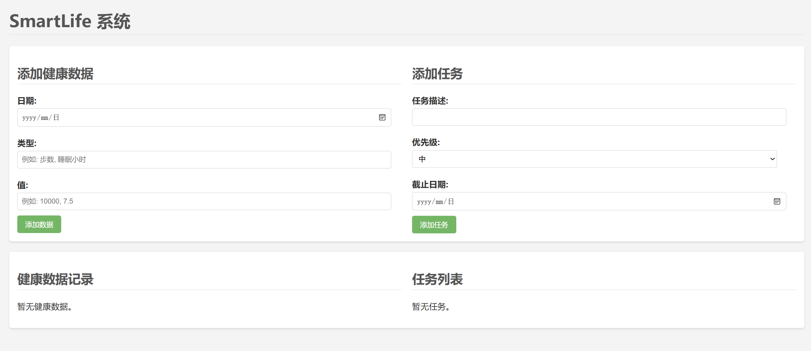
* 数据添加展示：

  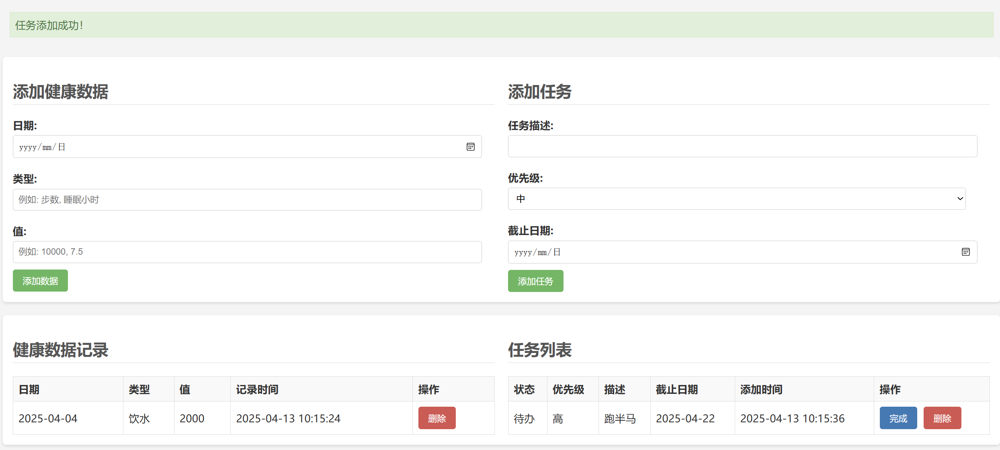
* 数据删除及标记完成展示：

  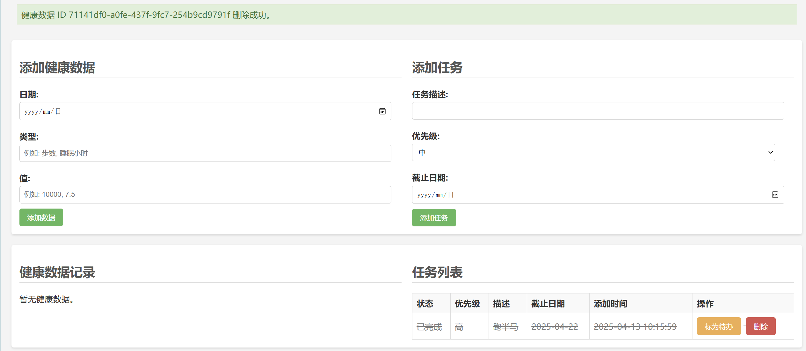

#### 3.2 成熟版（第二版）实现过程与功能展示

**3.2.1 增加功能：**

* 任务提醒与通知功能：为每个任务设置提醒，确保用户按时完成任务。提醒可以是定时的，也可以是基于任务优先级的智能提醒。
* 任务分组与标签功能：让用户能够为任务分组并添加标签，以便分类和整理。例如，可以根据任务的类型（工作、学习、个人生活）来进行分类，为任务打上优先级标签（高、中、低）。
* 健康目标追踪功能：用户可以设置每日或每周的健康目标，例如步数目标、喝水目标、睡眠目标等，系统会帮助用户跟踪目标的完成情况，并提供统计和趋势分析。
* 积分机制：每次完成任务获得一定积分。

**3.2.2 实现过程：**

    本版本是在上一版的基础上与copilot一起修改核心类（把上述提示词给到大模型并与大模型一同修改代码），然后将核心类再给到Gemini，然后一步一步按照文件结构，功能需求等引导得到我想要的前端与部分后端代码。

    本版本所有代码在我所交压缩包的smartlife_web_2文件中

* 核心类增加实现：

  ```
  SmartLifeApp 类
  │
  ├── 属性
  │   ├── health_data[] - 健康数据存储
  │   ├── tasks[] - 任务数据存储
  │   ├── health_goals[] - 健康目标存储 [新增]
  │   ├── user_points - 用户积分 [新增]
  │   └── POINTS_PER_TASK - 任务完成积分常量 [新增]
  │
  ├── 任务管理模块 (扩展)
  │   ├── add_task(description, priority="中", due_date=None, group=None, tags_str="") [扩展]
  │   │   └── 返回: 新任务ID
  │   │
  │   ├── get_tasks(status_filter=None, group_filter=None, tag_filter=None) [扩展]
  │   │   └── 返回: 过滤并排序后的任务列表
  │   │
  │   ├── get_task_by_id(task_id)
  │   │   └── 返回: 任务或None
  │   │
  │   ├── update_task(task_id, ..., new_group=None, new_tags_str=None) [扩展]
  │   │   └── 返回: 布尔值(更新成功与否)
  │   │
  │   ├── delete_task(task_id)
  │   │   └── 返回: 布尔值(删除成功与否)
  │   │
  │   ├── get_all_groups() [新增]
  │   │   └── 返回: 所有任务分组列表
  │   │
  │   └── get_all_tags() [新增]
  │       └── 返回: 所有任务标签列表
  │
  ├── 健康目标管理模块 [新增]
  │   ├── set_health_goal(goal_type, target, period)
  │   │   └── 返回: 目标ID
  │   │
  │   ├── get_health_goals()
  │   │   └── 返回: 健康目标列表
  │   │
  │   ├── delete_health_goal(goal_id)
  │   │   └── 返回: 布尔值(删除成功与否)
  │   │
  │   └── calculate_goal_progress(target_date=None)
  │       └── 返回: 目标进度字典
  │
  └── 积分系统模块 [新增]
      └── get_user_points()
          └── 返回: 用户积分总数
  ```
* 其他文件改动

  html前端加入了后端对应的功能模块，并加入了一些表情文字使得页面更加生动形象。

**3.2.3 效果展示**

* 主页面展示

  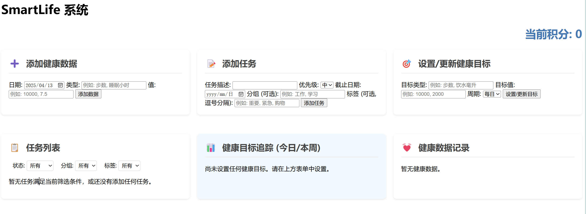
* 添加任务，目标健康数据 与目标更新展示：

  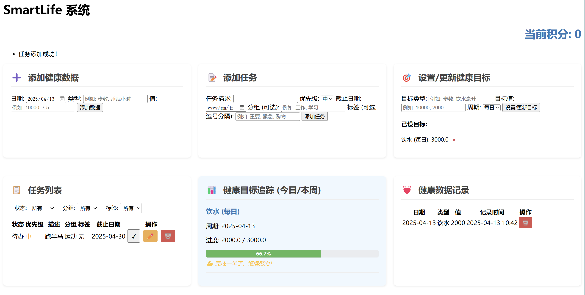
* 编辑任务展示

  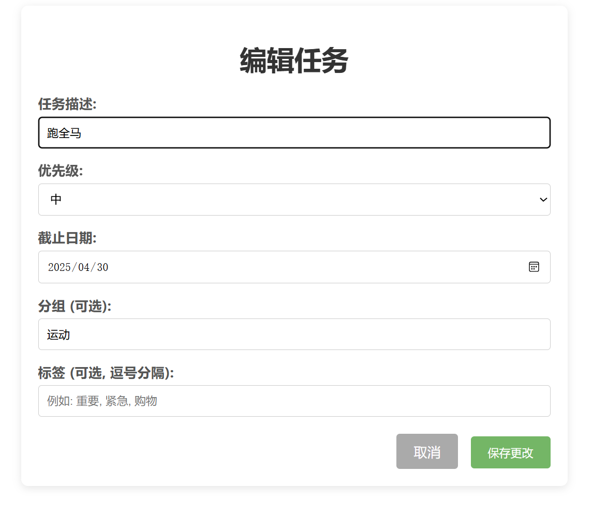
* 删除健康数据，设置任务完成与积分更新展示：

  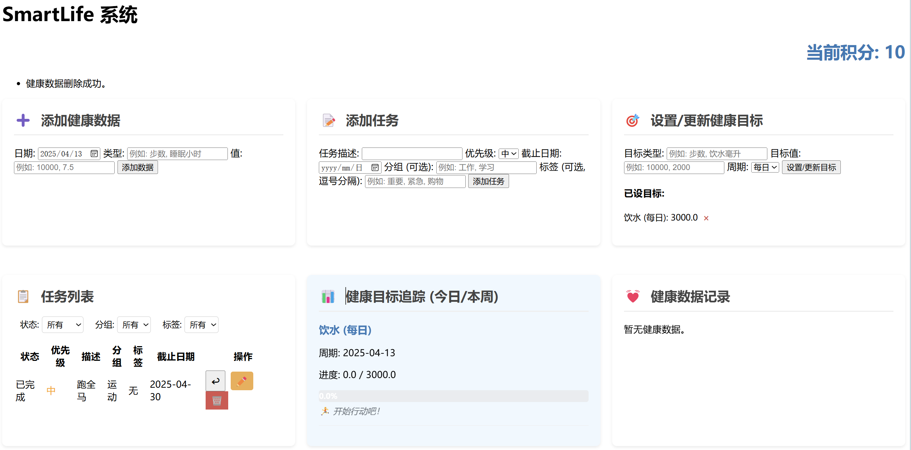

#### 3.3 最终版（第三版）实现过程与功能展示

上两个版本写完我个人对页面设计和功能复杂性等还是不太满意，所以决定全部推倒重来。这次选用更强大的AI助手软件Trae结合Claude3.7辅助编写后端，利用Deepsite辅助编写前端。并且改用JavaScript语言实现。（由于对此语言的不熟悉，此版借助ai的部分相对较多，但编写难度，编写时间，代码量等都远远超过前两版）

##### 3.3.1 新增功能

**SQLite数据库存储** ：健康数据使用关系型数据库存储，支持复杂查询

* **JSON文件存储** ：用户账户和任务数据保存到文件系统
* **WAL模式** ：提高数据库性能和可靠性

**用户认证系统（登录界面）**

* **JWT令牌认证** ：完整的JSON Web Token实现
* **用户注册和登录API** ：支持多用户系统
* **权限验证中间件** ：保护API接口安全

**REST API接口**

* **完整的API端点** ：提供HTTP接口给前端应用
* **标准HTTP方法** ：使用GET/POST/PATCH/DELETE进行资源操作
* **CORS支持** ：支持跨域请求

**增强的健康数据模型（数据统计分析功能）**

* **结构化健康数据** ：固定包含步数、睡眠时长、饮水量
* **时间筛选功能** ：支持按日/周/月查询健康数据
* **数据统计分析** ：提供汇总统计(总步数、平均睡眠等)

**增强的任务管理功能**

* **更丰富的任务属性** ：增加标题、描述、分类、提醒功能（尚未实现，但前端已留位）
* **多种优先级** ：使用字符串和颜色区分优先级

**更完善的用户积分系统**

* **积分奖励机制** ：添加健康数据奖励5积分
* **积分查询API** ：用户可查看自己的积分
* **新用户初始积分** ：注册用户获得初始50积分

**更完整的Web应用支持**

* **静态文件服务** ：提供HTML、CSS、JavaScript文件
* **页面路由** ：支持多页面应用
* **错误处理** ：友好的错误响应和日志记录

##### 3.3.2 实现过程

首先将我的需求总结一下，把前两版的所有功能和我第三版想加入的创新功能（健康数据图表化分析，医疗数据存储，登陆界面等）总结，结合我的结构要求发送给deepsite，让它生成前端：

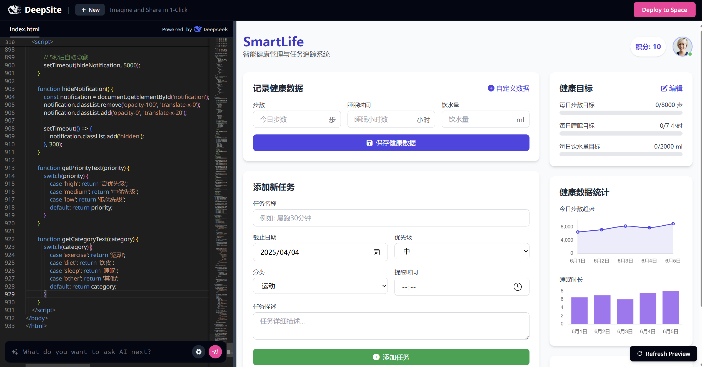

然后再根据我的要求让他对页面进行调整，得到初始的主页面：

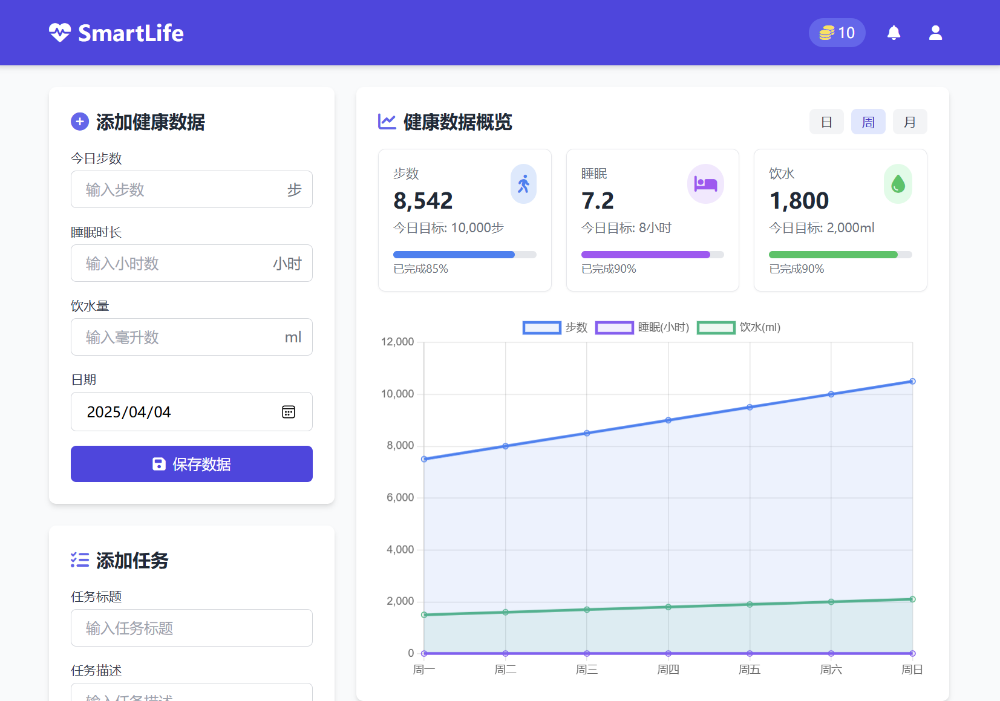

然后利用Trae，根据主页面生成对应后端代码：

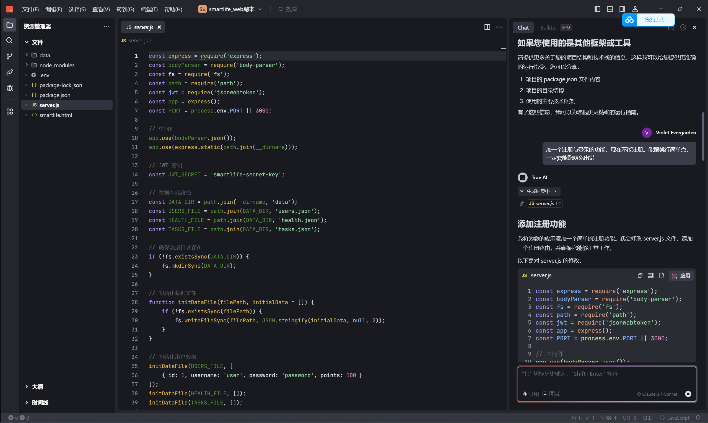

接着就是枯燥痛苦而又漫长的改bug过程。目前的大模型改bug还是不成熟，所以本步骤不仅需要利用AI,还需要自己熟知程序每个文件的架构，内容，以及每个函数的位置，实现内容。在询问AI才能做到较精确的修改。

我发现把所有前端功能写到一个页面里很可能导致程序崩溃或出现bug，且后续相当难以修改维护。所以后续我把主页面的部分功能又分成不同的页面显示，此处又添加了多个不同页面：

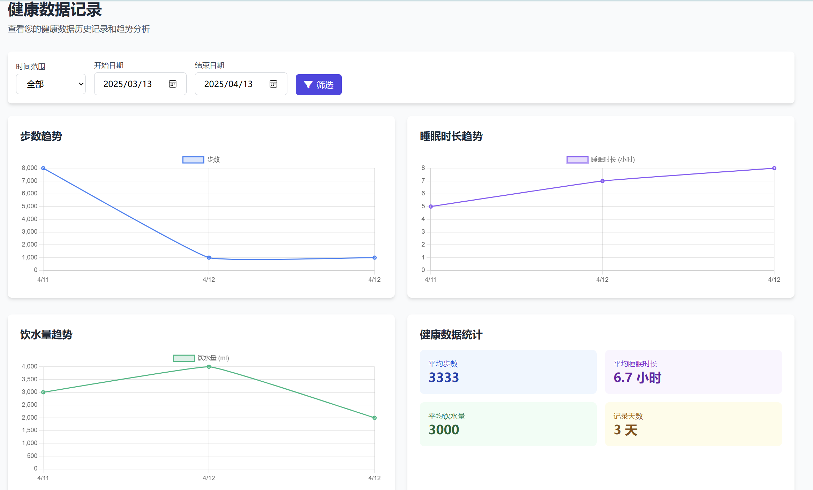

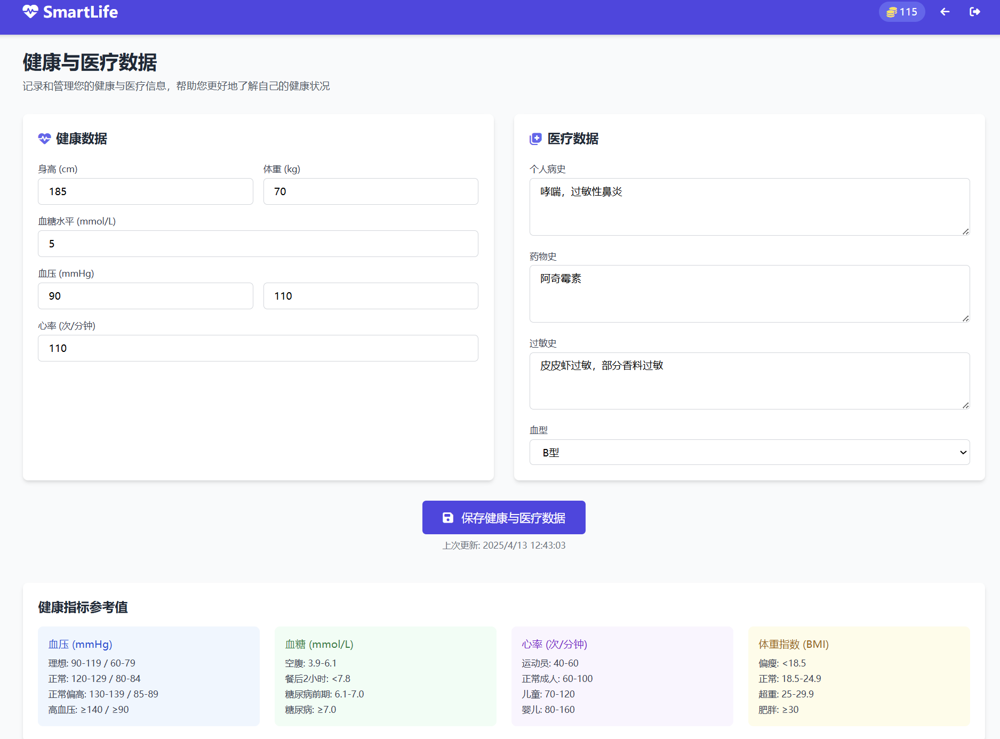

由于一开始写在主页面里面的健康数据详情比较难用，并且让主页面的前端文件变得庞大冗杂，所以我将原来在smartlife.html的健康数据详情单独移为另一个页面：健康数据记录

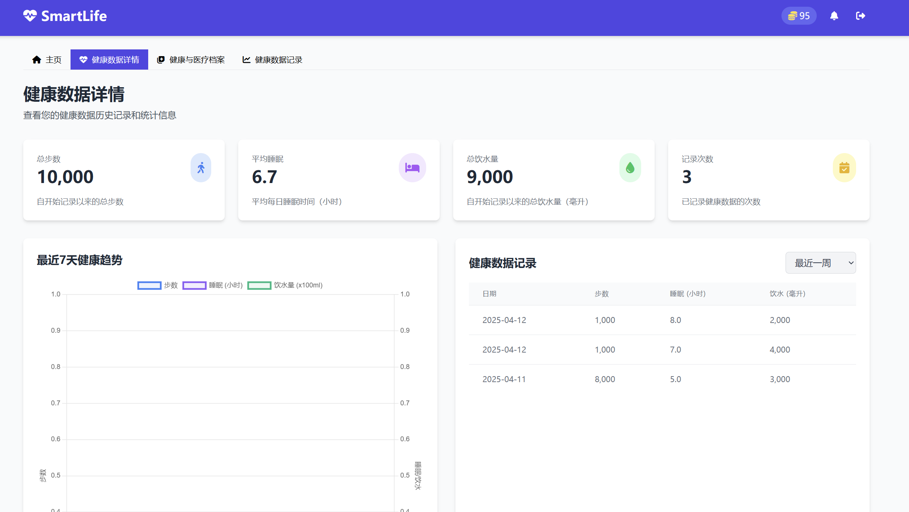

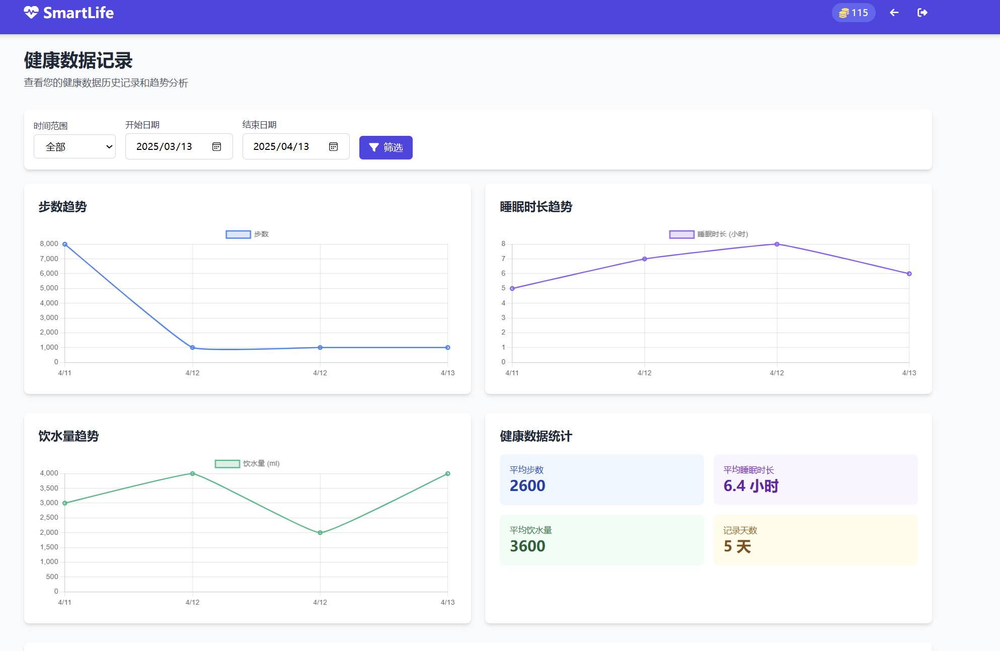

##### 3.3.2 效果展示

最终版效果展示在第五章《最终版效果展示》展出。

---

### 4. 项目功能介绍与实现分析（最终版）

#### 4.1 项目功能与实现分析

**4.1.1 增 - 添加新信息**

1. **用户账户创建（注册）:**

   * **用户体验:** 在 `login.html` 页面，用户切换到“注册”标签页，填写期望的用户名和密码，然后提交。
   * **数据流:** 前端将凭据发送到 `/api/auth/register` 端点。后端检查 `users.json` 中用户名是否存在。如果不存在，则创建一个包含初始积分（例如 50 分）和唯一 ID 的新用户条目，将其保存回 `users.json`，生成一个 JWT 令牌，并将令牌发送回前端。
   * **代码片段 (后端）:**
     ```javascript
     // server.js (在 POST /api/auth/register 内部)
     if (users.some(u => u.username === username)) {
       return res.status(409).json({ error: '用户名已存在' });
     }
     const newUser = { id: generateId(), username, password, points: 50 }; // 创建新用户对象
     users.push(newUser);
     writeData(USERS_FILE, users); // 保存更新后的用户列表
     const token = jwt.sign({ id: newUser.id, username }, JWT_SECRET, { expiresIn: '24h' }); // 生成Token
     res.status(201).json({ token }); // 返回Token
     ```
2. **每日健康数据记录:**

   * **用户体验:** 用户在 `smartlife.html` 或 `health-data.html` 的表单中输入指定日期的步数、睡眠小时数和饮水毫升数（默认为今天），然后点击“保存数据”。
   * **数据流:** 前端通过 POST 请求将数据（步数、睡眠、饮水、日期）和用户的 JWT 令牌发送到 `/api/health` 端点。后端验证令牌，将数据插入到 `smartlife.db` 的 `health_data` 表中（与令牌中的用户 ID 关联），更新 `users.json` 中的用户积分，并返回成功消息。前端随后更新相关的 UI 元素，如每日统计数据和可能的健康图表。
   * **代码片段 (前端):**
     ```javascript
     // smartlife.html 脚本
     async function addHealthData(e) {
       // ... 从表单元素获取值 ...
       const response = await fetch('/api/health', {
         method: 'POST',
         headers: {
           'Content-Type': 'application/json',
           'Authorization': `Bearer ${token}` // 发送Token进行认证
         },
         body: JSON.stringify({ steps, sleep, water, date })
       });
       if (response.ok) {
         // ... 处理成功：清空表单，更新UI，显示提示 ...
         fetchUserPoints(); // 更新显示的积分
         fetchHealthStats(); // 刷新统计数据显示
       } // ... 处理错误 ...
     }
     ```
3. **任务创建:**

   * **用户体验:** 在 `smartlife.html` 上，用户填写“添加任务”表单（标题、描述、优先级等）并提交。
   * **数据流:** 前端将任务详情和令牌发送到 `/api/tasks` (POST)。后端验证令牌，创建一个包含唯一 ID（例如时间戳）和用户 ID 的新任务对象，将其添加到 `tasks.json` 数组中，保存文件，并返回新创建的任务对象。前端将任务可视化地添加到列表中。
4. **健康与医疗档案录入:**

   * **用户体验:** 在 `health-medical-info.html` 上，用户填写各种字段（身高、体重、过敏史等）并点击“保存”。
   * **数据流:** 前端将所有档案数据和令牌发送到 `/api/health-medical-info` (POST)。后端验证令牌，在 `health_medical_info` 表中插入一条*新记录*，包含当前时间戳和用户 ID（这实际上创建了一个版本历史，尽管当前前端只检索最新的一条）。积分会被奖励。后端返回成功。前端显示“上次更新”时间。

**4.1.2  查 - 查看信息**

1. **用户认证（登录）:**

   * **用户体验:** 在 `login.html` 上，用户输入他们的凭据并提交登录表单。
   * **数据流:** 前端将用户名/密码发送到 `/api/auth/login`。后端在 `users.json` 中搜索匹配项。如果找到，它会生成一个 JWT 令牌，并连同用户的积分一起发回。前端存储令牌（例如，在 `localStorage` 中）并重定向到 `smartlife.html`。
2. **页面数据显示 (`smartlife.html`):**

   * **数据流:** 加载时，前端使用存储的令牌进行多个 API 调用：
     * `GET /api/user/points`: 获取当前积分。
     * `GET /api/health/stats`: 获取今日统计数据和近期数据，用于概览卡片和图表。
     * `GET /api/tasks`: 获取该用户的所有任务。
   * **UI 更新:** JavaScript 填充积分计数器、健康卡片（步数、睡眠、饮水进度）、概览健康图表（使用 Chart.js）和任务列表。
3. **详细健康历史 (`health-records.html`, `health-data.html`):**

   * **数据流:** 这些页面从 `/api/health` (GET) 获取数据，可带有 `period` 参数（week, month, all）。后端根据用户 ID 和时间段过滤器查询 `health_data` 表。
   * **UI 更新:** 数据显示在可排序的表格中。`health-records.html` 还使用 Chart.js 根据获取的数据为步数、睡眠和饮水量分别渲染趋势图。
4. **健康与医疗档案查看 (`health-medical-info.html`):**

   * **数据流:** 前端调用 `GET /api/health-medical-info`。后端查询 `health_medical_info` 表中该用户的*最新*记录（限制为 1 条）。
   * **UI 更新:** 获取到的数据填充到表单字段中。

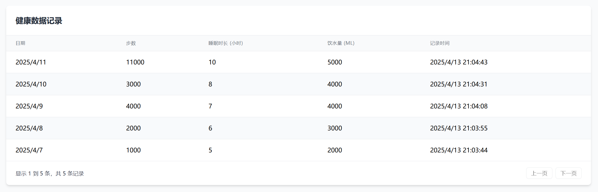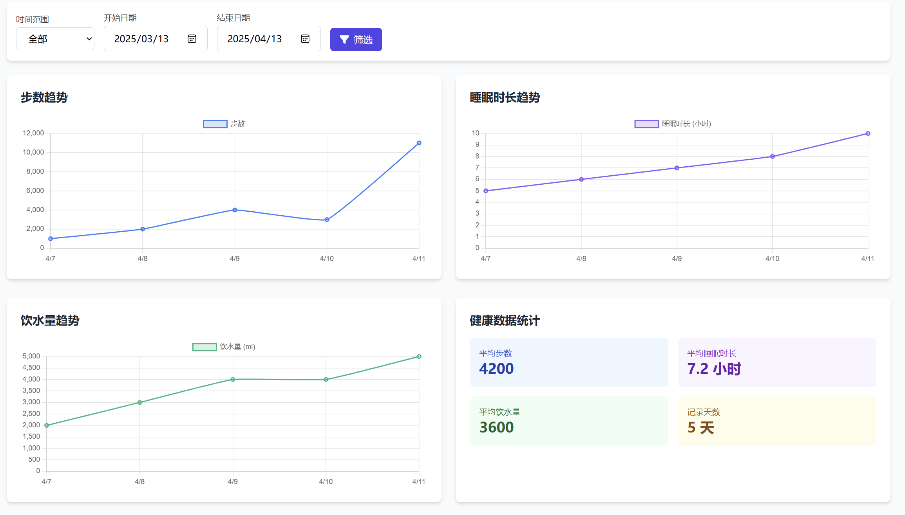

**4.1.3 改 - 更改现有信息**

1. **任务完成状态切换:**

   * **用户体验:** 用户在 `smartlife.html` 上点击任务旁边的复选框。
   * **数据流:** 前端发送一个 `PATCH /api/tasks/:id` 请求，包含新的 `completed` 状态（true/false）和令牌。后端在 `tasks.json` 中按 ID 找到任务，更新其 `completed` 属性，保存文件，并返回更新后的任务。前端视觉上更新任务的外观（例如，添加删除线）。
   * **代码片段 (后端 ):**
     ```javascript
     // server.js (在 PATCH /api/tasks/:id 内部)
     const taskIndex = tasks.findIndex(t => t.id === taskId && t.userId === userId); // 查找任务索引
     if (taskIndex === -1) return res.status(404).json({ error: '任务未找到' });
     tasks[taskIndex].completed = req.body.completed; // 更新状态
     writeData(TASKS_FILE, tasks); // 保存更改
     res.json(tasks[taskIndex]); // 返回更新后的任务
     ```
2. **健康与医疗档案更新:** （通过创建处理）如前所述，当前实现在用户保存 `health-medical-info.html` 上的更改时，会保存一条新记录，而不是直接更新旧记录。

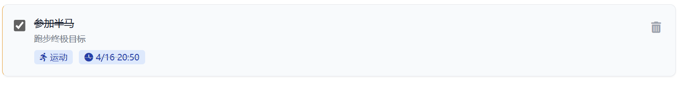

**4.1 4 删 - 移除信息**

1. **任务删除:**
   * **用户体验:** 用户在 `smartlife.html` 上点击任务旁边的垃圾桶图标，并在提示框中确认操作。
   * **数据流:** 前端发送一个 `DELETE /api/tasks/:id` 请求，携带令牌。后端过滤 `tasks.json` 数组，移除该用户匹配 ID 的任务，保存更新后的数组，并返回成功状态（例如，204 No Content）。前端从 UI 中移除该任务元素。

 **4.1.5 其他功能**

1. **登录页面JWT 认证:** 提供了一种无状态的方式来验证每个 API 请求的用户身份，无需服务器端会话。令牌包含编码的用户信息（ID、用户名）和一个只能由服务器验证的签名，确保了数据的完整性和安全性。
2. **数据可视化 (健康数据图表显示):** 将原始的数字健康数据转换为易于理解的折线图和条形图，帮助用户快速识别趋势、模式以及目标的进展情况。
3. **积分系统:** 激励机制，通过为持续记录数据或更新档案等行为奖励积分，来鼓励用户参与。

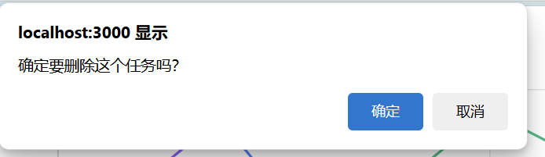

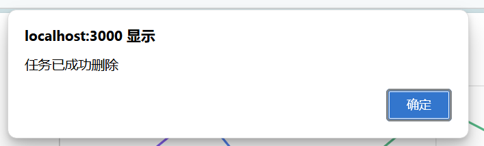

#### 4.2 项目结构分析

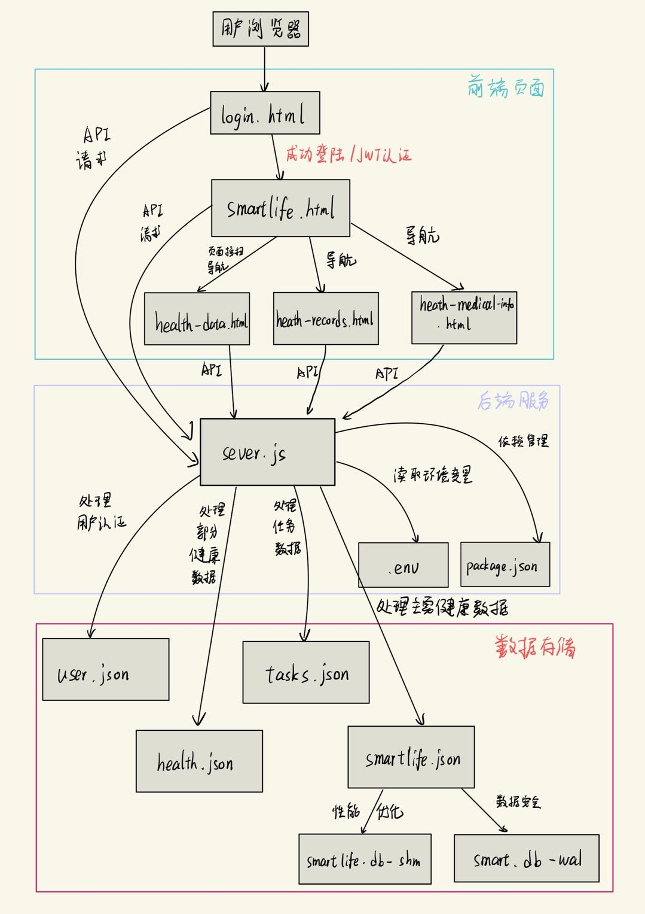

---

### 5. 结果展示与分析（最终版）

#### 5.1 功能完成度评估

对照第二章定义的功能性需求 (FR)，对SmartLife系统的功能完成度进行评估：

* **FR1: 用户认证模块**

  * FR1.1 用户注册: **已完成。** 后端能接收注册信息，检查用户名唯一性，并将新用户信息（用户名、明文密码、初始积分）存入 `users.json`。
  * FR1.2 用户登录: **已完成。** 后端能验证用户名和明文密码，成功后生成JWT并返回给前端。
  * FR1.3 令牌验证: **已完成。** 后端提供了 `/api/auth/verify`接口，并通过 `authenticateToken`中间件保护了需要登录的API。前端在页面加载时会调用此接口验证登录状态。
  * FR1.4 登出: **已完成。** 前端提供了登出按钮，点击后清除本地 `localStorage`中的Token并跳转回登录页。
  * **待改进:** 用户密码未使用哈希加盐存储，存在严重安全隐患。未实现密码找回、修改密码等功能。

  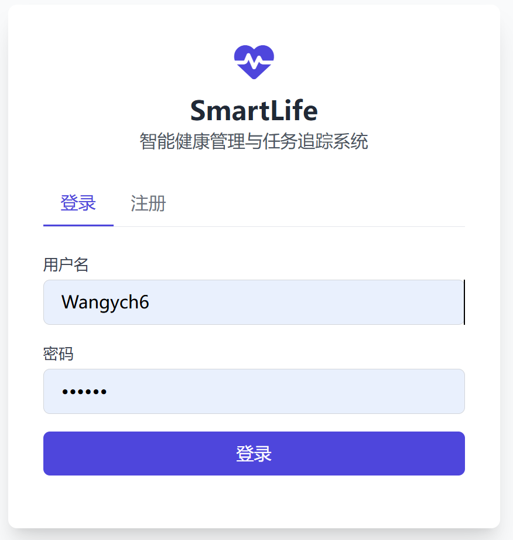

  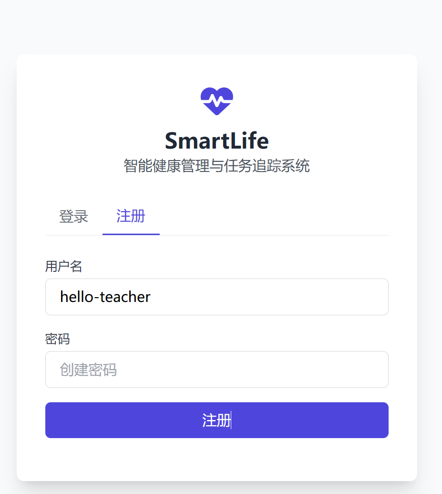
* **FR2: 健康数据管理模块**

  * FR2.1 添加健康数据: **已完成。** 用户可在主页或详情页表单输入指定日期的步数、睡眠、饮水，数据成功保存到后端SQLite数据库，并获得积分奖励。
  * FR2.2 获取今日健康数据概览: **已完成。** 主页能显示当天的健康数据卡片。
  * FR2.3 计算并显示健康目标进度: **已完成。** 主页的健康数据卡片包含进度条。
  * FR2.4 获取健康数据统计: **已完成。** 健康数据详情页能显示总步数、平均睡眠、总饮水量、记录天数等统计卡片。
  * FR2.5 获取健康数据历史: **已完成。** 健康数据详情页的数据表格能根据用户选择的时间段（周、月、全部）从后端获取并展示数据。
  * FR2.6 健康数据可视化:  **已完成。** 健康数据详情页能展示最近7天的健康数据综合趋势线图。
  * **待改进:** 未对用户输入的健康数据进行严格的范围校验（如睡眠时间不能超过24小时），后续还需继续改进。 获取健康数据历史的日周月有几率出现一定bug

  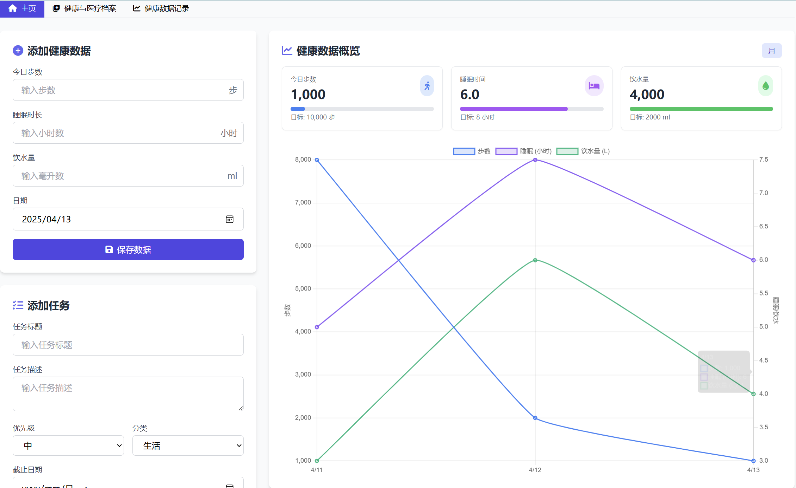

  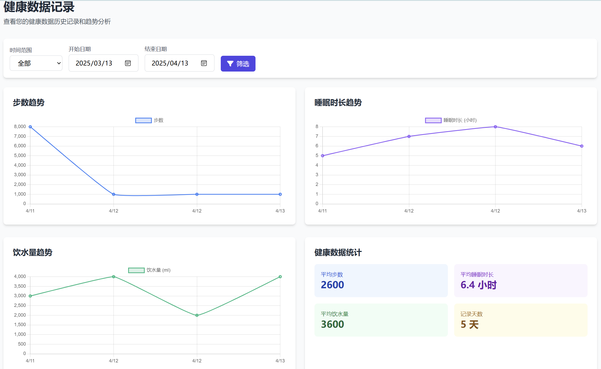
* **FR3: 任务管理模块**

  * FR3.1 添加任务: **已完成。** 用户可通过表单添加任务，包含标题、描述、优先级、分类、截止日期（可选）。数据保存到 `tasks.json`。
  * FR3.2 查看任务列表: **已完成。** 主页能展示当前用户的所有任务。
  * FR3.3 筛选任务: **已完成。** 主页提供了“全部”、“待办”、“已完成”的筛选按钮，能正确过滤并显示任务列表。
  * FR3.4 标记任务完成/未完成: **已完成。** 用户可通过任务项前的复选框切换任务状态，状态实时更新到后端 `tasks.json`并反映在UI上。
  * FR3.5 删除任务: **已完成。** 用户可通过任务项旁的删除按钮删除任务，数据从后端 `tasks.json`移除，UI同步更新。
  * FR3.6 任务属性展示: **已完成。** 任务项能清晰展示标题、描述、优先级（颜色边框）、分类（图标+名称）、截止日期，并对已完成任务应用删除线样式，逾期任务（暂未实现视觉标示，但在代码中有判断逻辑）。
  * **待改进:** 暂时未实现FR3.1中提到的“提醒”功能。但加了提醒按钮，接下来正式版制作完善后会将这个模块补上。小bug：在添加任务后任务列表全部会清空，这时候需要先点进待办再回来才能看见全部任务，接下来正式版制作完善后会将这个bug修复完善。

    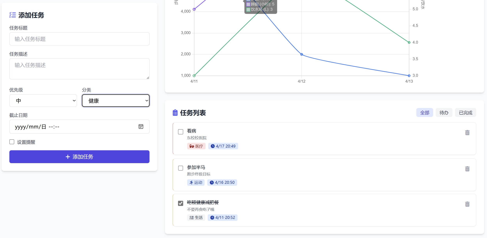

    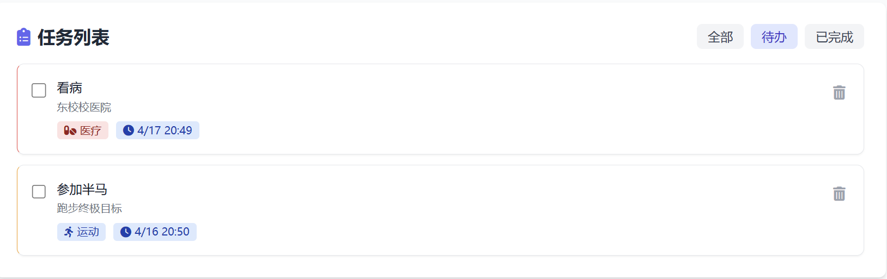

    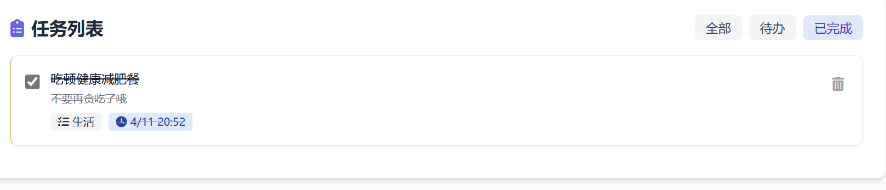
* **FR4: 积分系统模块**

  * FR4.1 积分获取: **已完成。** 添加健康数据后，用户积分会自动增加（硬编码+5分）。
  * FR4.2 积分展示: **已完成。** 顶部导航栏能实时显示用户当前积分。
  * **待改进:** 积分获取规则单一，可扩展更多获取途径（如完成任务、连续打卡等）。未提供积分明细或积分商城等消费途径。 接下来我在放进小组项目的正式版要继续完善此项功能

    
* **FR5: 通知模块 (暂未完成)**
* **FR6:健康与医疗档案模块**

  * FR6.1: 保存健康数据：**已完成。**保存用户身高，体重，血糖，血压，心率等健康数据
  * FR6.2: 保存医疗数据：**已完成。**保存用户病史，药物史，过敏史，血型等医疗数据。
  * FR6.3: **已完成。**医疗健康数据的增删查改。

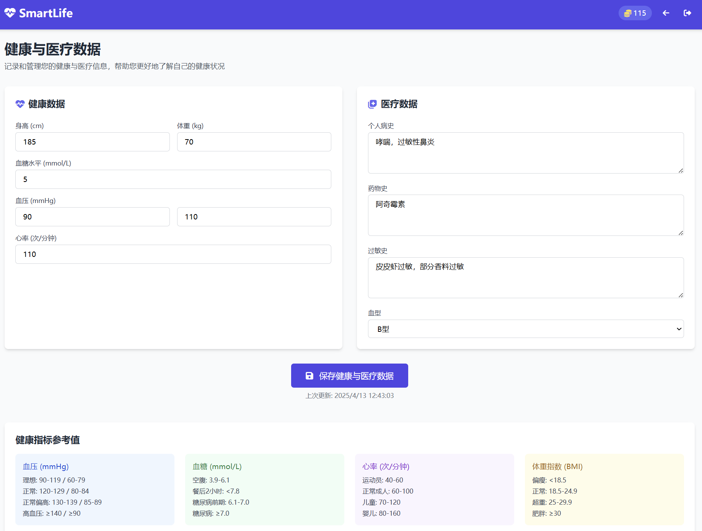

#### 5.2  内容完整性与逻辑清晰度

* **数据展示:** 系统能展示用户的积分、今日健康数据、健康统计、历史健康记录、任务列表等核心内容。内容基本完整。
* **标签与提示:** 界面元素的标签（如表单字段、按钮文字、图表标题、坐标轴标题、表格列头）基本清晰，能帮助用户理解其含义和功能。错误提示（如登录失败、表单未填写）能够引导用户。
* **数据逻辑:**
  * 健康数据的记录、统计（总和、平均、计数）、按时间筛选逻辑基本清晰，并在后端通过SQL实现。
  * 任务的添加、基于完成状态的筛选、状态更新、删除逻辑清晰，并在后端通过操作JSON数组实现。
  * 积分逻辑简单明了（添加健康数据+5分）。
* **流程逻辑:** 用户从登录到进入主界面，再到记录数据、查看图表、管理任务的流程基本顺畅。Tab切换和筛选功能逻辑也比较直观。

#### 5.3 界面展示效果与表达清晰度

* **视觉设计:** 借助Tailwind CSS，界面呈现出简洁、现代的风格。色彩搭配（以靛蓝为主色调，辅以蓝、紫、绿、黄等用于卡片和图表）比较协调。

  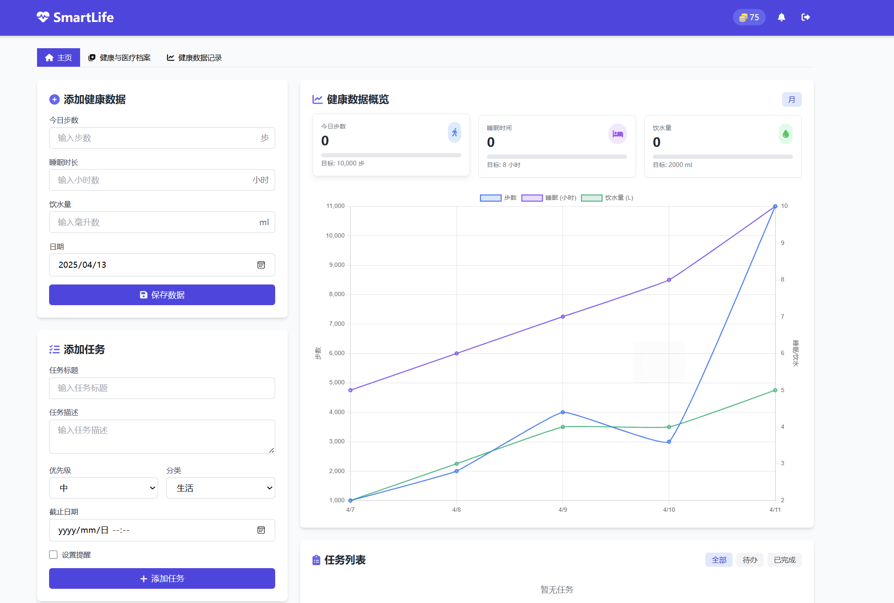
* **布局与响应性:** 整体布局（导航栏、内容区、底部）清晰。主页内容区的三栏（或响应式变化）布局合理利用了空间。卡片式设计使信息模块化。对不同屏幕尺寸的适应性有基本考虑（通过 `md:`、`lg:`前缀）。
* **信息传达:**

  * 健康数据概览卡片通过数字、图标、进度条直观传达今日状况。
  * 图表（线图、柱状图）有效地可视化了数据趋势，多Y轴设计区分了不同量纲的数据。
  * 任务列表通过颜色边框区分优先级，复选框和删除线标示完成状态，标签显示分类和日期，信息密度较高但基本清晰。
  * 表单元素标签清晰，输入框带有占位符或单位提示。
* **交互体验:**

  * Tab切换、按钮点击、表单提交等交互反馈及时。
  * 悬停效果（按钮、卡片）提供了视觉反馈。
  * 页面加载时的 `fade-in` 动画提升了体验。

### 6. 创新性与反思总结

#### 6.1 项目创新点分析

虽然本项目使用的技术栈相对常规，且核心功能（健康记录、任务管理）在市面上已有成熟应用，但SmartLife系统在以下几个方面体现了一定的整合与微创新：

1. **健康与任务的融合管理:** 与单一的健康追踪或任务管理应用不同，SmartLife将这两者紧密结合在同一平台。用户可以在一个界面内同时关注自身的健康状况和健身等待办事项，这有助于用户更全面地审视和规划自己的生活，将健康目标（如坚持运动、按时休息）与具体任务（如预约体检、购买健康食品）联系起来，形成一个更整体的生活管理视图。
2. **积分激励机制的引入:** 本项目将游戏化思维应用于健康和任务管理。通过完成健康数据记录等积极行为给予积分奖励，虽然目前积分系统还比较基础，但它为提升用户粘性、鼓励用户持续使用系统、从而促进良好习惯养成提供了一个有效的驱动力。未来可围绕积分系统构建更丰富的玩法，如成就系统、排行榜、积分兑换等。
3. **健康数据概览与图表可视化:** 主页的“健康数据概览”部分提供了今日关键指标的快速视图，并结合了目标进度条，给予用户即时的反馈。同时，集成了Chart.js实现了健康数据的多维度可视化（日/周/月趋势、多指标对比），使用户能更直观地理解数据背后的模式和趋势，而不仅仅是罗列数字。
4. **个人健康与医疗数据存储库**：未来正式版接入本小组的“逸仙慧诊”智能问诊平台后，可以根据本存储库的信息精确获取病史药物史等医疗信息，进一步提高网上诊疗的精确性。
5. **未来与小组项目的结合前景：**未来正式版接入本小组的“逸仙慧诊”智能问诊平台，将与本健康生活系统产生1+1>2的乘数效应，互相引流，成为一个更加完善成熟的综合性应用。

#### 6.2 遇到的困难、问题及解决方案

在SmartLife系统的开发过程中，我遇到了多方面的挑战和技术难题。以下是主要的困难及其对应的思考和解决方案：

**6.2.1 AI的局限性与人机协作的协调性**

* **困难:** AI输出的代码不总是正确的，很多情况下有很多bug。而且AI改bug的时候也是错误百出，很多时候为了修复一两个小bug而改出三四个大bug，经常会为了修改一个小bug或者增加一个小功能就花费两三小时的时间。
* **解决方案/思考:**
  * **提升个人代码能力:** 目前阶段AI还相当需要人工挨个函数进行检查。需要个人学习项目代码底层实现，再人工排查可能的错误点，后自行修改或者提示ai进行修改。
  * **尝试不同的AI模型：** 有时候一个模型发现不了自己的错误，这时候就需要换一个AI模型，代码能力强大的大模型有：Claude3.7 Sonnet Thinking， Gemini2.5 Pro , deepseek V3 - 0324

**6.2.2 版本迭代的存储问题**

* **困难:** 在多个版本进行迭代时，一开始我采用的本地复制存储以前的版本。但这样到后期版本数积压多了之后不仅不美观，空间占用还很大。而且如果忘了备份修改前的版本，修改后的版本还崩溃了无法撤回的话，就无法找回此前的正确代码。我就是忘记备份前版本导致代码崩溃后无法复原，只能回退回远古版本从新来过。损失了整整一个下午的成果！

  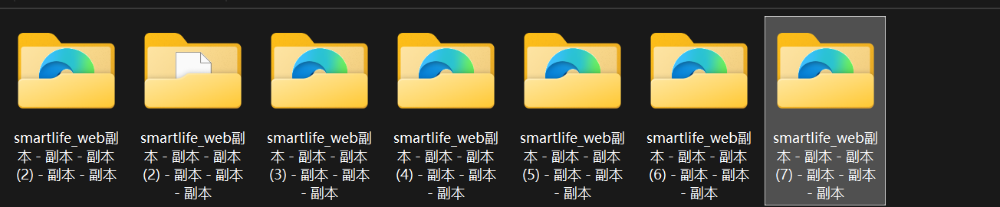
* **解决方案:**

  * git版本上传更新：后续编写中，我学习了git的使用。每次版本迭代后可以轻松在终端把新一个版本上传上本地git或网络github项目中。完美解决了上述问题，为日后的软件开发工作积攒了经验

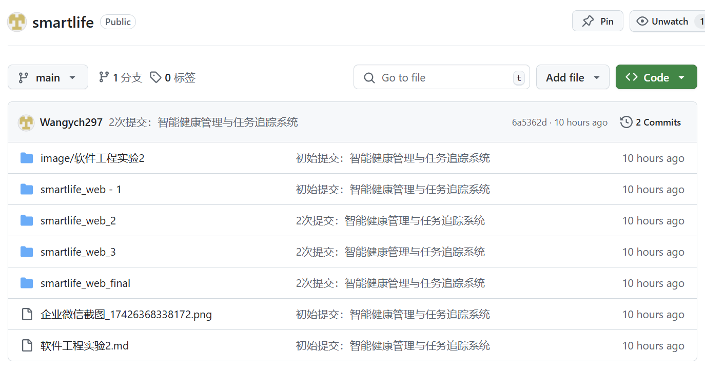

#### 6.3 自我评价与项目反思

* **优点:**
  * 成功实现了项目的核心功能，搭建了一个可运行的SmartLife系统原型。
  * 学习了前后端分离架构和相关技术栈（Node.js, Express, SQLite, JWT, Vanilla JS, Tailwind CSS, Chart.js）。
  * 界面设计简洁直观，数据可视化效果良好。
  * 功能设计基本满足目标。
  * 通过项目实践，加深了对Web开发全流程、异步编程、数据持久化、用户认证、API设计等方面的理解。
* **不足与反思:**
  * **安全性:** 用户密码明文存储不是很安全，后续需要修正。对JSON文件存储的依赖也带来了安全和性能隐患。需要加强安全意识和实践。
  * **代码质量:** 前端JavaScript代码全部内嵌在HTML中，且未使用模块化，导致 `smartlife.html` 文件过大，难以维护。后端 `server.js` 也可以进一步拆分路由和逻辑。可以引入更严格的编码规范和静态检查工具。
  * **健壮性:** 错误处理机制可以更完善，例如，提供更具体的错误信息给用户，后端对输入数据进行更严格的校验。
  * **用户体验细节:** 在加载状态提示、表单校验反馈、长列表滚动等方面还有优化空间。
  * **测试:** 主要依赖手动功能测试，缺乏自动化测试（单元测试、集成测试、端到端测试），这在项目复杂化后难以保证质量。
  * **一部分小漏洞尚未修复：**在我的程序中还有一部分小错误，比如添加任务后全部任务暂时空白等问题，待后续继续改进。

#### 6.4 改进方向与未来工作展望

基于以上反思，SmartLife系统的未来发展有以下改进方向和展望：

1. **安全性增强:**
   * **密码哈希:** 立即采用 `bcrypt` 或类似库对用户密码进行哈希加密存储。
   * **数据存储迁移:** 将用户和任务数据从JSON文件迁移到数据库（可以是SQLite，或考虑升级到PostgreSQL/MySQL），统一数据管理，利用数据库事务保证一致性，提高性能和安全性。
2. **代码质量与可维护性提升:**
   * **前端模块化:** 将前端JavaScript代码拆分成多个模块（使用ES Modules），按功能组织文件结构。
   * **后端代码重构:** 将 `server.js` 中的路由处理逻辑拆分到独立的路由文件中，业务逻辑可以进一步封装到Service层。
   * **引入构建工具:** 使用Webpack或Vite等前端构建工具，实现代码打包、压缩、模块化管理和开发服务器优化。
   * **引入代码规范和检查:** 使用ESLint、Prettier等工具强制执行代码风格和最佳实践。
3. **功能增强与扩展:**
   * **任务提醒:** 实现基于截止日期的浏览器通知或邮件提醒功能。
   * **自定义目标:** 允许用户设置个性化的健康目标（步数、睡眠、饮水等）。
   * **更丰富的健康指标:** 增加记录心率、体重、运动类型/时长等更多健康维度。
   * **高级任务管理:** 增加任务标签、子任务、重复任务、任务排序/过滤选项等。
   * **积分系统扩展:** 设计更完善的积分获取规则（如完成任务、连续打卡）、积分等级、成就系统、积分兑换（虚拟或实物奖励）。
   * **社交功能:** 考虑添加好友系统、健康/任务打卡分享、排行榜等社交元素。
   * **数据分析与报告:** 提供更深入的数据分析报告，例如周/月健康总结、睡眠质量分析、任务完成率统计等。
4. **用户体验优化:**
   * **加入移动端支持：**后续我将进一步将我的软件在Android studio上更改成移动端应用，更好的符合当下用户的主流习惯。
   * **与小组项目“逸仙慧诊”融合：**形成一个更完整的综合性应用。
5. **测试:** 引入自动化测试框架（如Jest, Mocha, Cypress），编写单元测试、集成测试和端到端测试，保障系统质量和稳定性。

---

### 7. 运行与部署

#### 7.1 准备环境

确保您的计算机已安装Node.js环境：

```
# 检查Node.js是否已安装
node -v
# 检查npm是否已安装
npm -v
```

如果未安装，请访问[Node.js官网](vscode-file://vscode-app/c:/Users/86155/AppData/Local/Programs/Microsoft%20VS%20Code/resources/app/out/vs/code/electron-sandbox/workbench/workbench.html)下载并安装最新的稳定版本。

#### 7.2 安装依赖

打开命令行工具（如PowerShell或CMD），导航到项目目录：

例如：

```
cd C:\Users\86155\Desktop\smartlife\smartlife_web_final
```

安装项目所需的依赖：

```
npm install
```

此命令会根据package.json文件安装所有必要的依赖项，可能包括express、better-sqlite3、jsonwebtoken等。

#### 7.3 启动服务器

安装完依赖后，启动Web服务器：

```
node server.js
```

如果一切正常，您应该会看到类似于以下的输出：

```
服务器运行在 http://localhost:3000
```

#### 7.4 访问应用

打开Web浏览器，访问以下地址：

```
http://localhost:3000
```

系统应该会显示登录页面(login.html),运行成果，请注册账户享受您的健康生活之旅。

---

### 8. 结论

本项目成功设计并实现了一个名为SmartLife的智能健康管理与任务追踪系统。系统采用Node.js、Express、SQLite、JWT构建后端API，使用HTML、Tailwind CSS、原生JavaScript和Chart.js构建前端界面，实现了用户认证、健康数据记录/统计/可视化、任务管理和基础积分功能。通过前后端分离的架构，项目验证了将个人健康管理与任务追踪相结合，并辅以积分激励的可行性。

开发过程不仅锻炼了我的Web全栈开发技能，也深入实践了API设计、数据持久化（混合模式）、用户认证、数据可视化等关键技术。同时，项目也暴露出在安全性、代码组织、错误处理和测试等方面存在的不足。

SmartLife系统作为一个原型，展示了其潜在的应用价值，能够帮助用户更便捷、更智能地管理自己的健康和生活。未来的工作重点在于安全性加固、代码质量提升、功能扩展和用户体验优化，有望将其打造成一个更成熟、更实用的个人效率与健康管理平台。本次项目实践为后续的系统迭代和更复杂应用的开发积累了宝贵的经验和教训。
