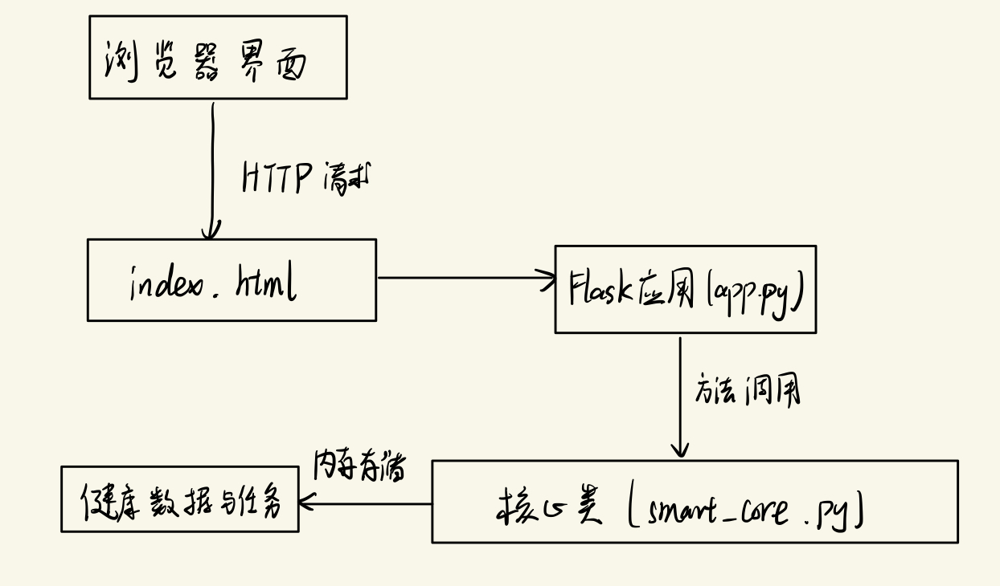

# 软件工程实验任务

# 2024第二学期

## SmartLife - 智能健康管理与任务追踪系统 实验报告文档

### 简述

#### 项目简介

本项目旨在设计并实现一个名为“SmartLife”的智能健康管理与健康任务追踪系统。在全球数字化和健康意识日益增强的背景下，个人健康数据管理和健身任务规划成为提升生活质量的重要手段。SmartLife系统通过整合每日健康指标（步数、睡眠时长、饮水量）记录与个人健身任务管理功能，辅以积分激励机制，旨在帮助用户建立健康的生活习惯，并高效地管理个人事务。

#### 灵感来源

由于本学期我的小组团队正在做“逸仙慧诊”智能分诊问诊系统。功能主要是整合中山大学各个附属医院资源优势，为患者提供科室推荐，个性化医生推荐与在线虚拟医生诊疗服务。所以本次实验我想为本小组的逸仙慧诊系统做一个辅助性的健康管理平台，用以记录统计用户的健康数据,医疗数据，并通过任务管理督促用户养成良好的健身习惯。

#### 技术简介

本项目软件一共经历了三次迭代，第一版是我编写后端类实现代码，并让AI优化生成前端代码的简易实现版。第二版是我和AI一起将第一版的前后端进行优化，再添加了一些新功能的成熟版。第三版是我与AI协作完全重新修改，将前面两版的简易风格脱胎换骨改成商业软件界面风格，美观好看的Beta测试版（最终版）。下面的项目介绍中我将详细介绍最后一版，辅以对前两版的描述。

最终版系统采用前后端分离架构，后端基于Node.js和Express.js构建RESTful API，使用 `better-sqlite3`操作SQLite数据库进行健康数据持久化，并结合JSON文件存储用户和任务信息（注：实际代码中用户和任务数据仍使用JSON，健康数据使用SQLite）。用户认证采用JWT（JSON Web Tokens）机制保障安全性。前端则利用HTML、Tailwind CSS和原生JavaScript构建交互界面，并集成Chart.js库实现健康数据的可视化展示。本报告将详细阐述项目的需求分析、系统设计、技术实现、功能测试、结果评估以及创新反思，全面展示项目的开发过程与成果。

### 目录

1. 引言
   1.1 背景与意义
   1.2 项目目标
2. 项目需求分析
   2.1 功能性需求
   2.2 非功能性需求
3. 项目迭代过程
   3.1 简易版（第一版）实现过程与功能展示
   3.2 成熟版（第二版）实现过程与功能展示
   3.3 最终版实现过程与结果展示
4. 项目功能介绍与实现分析
5. 最终版效果展示
6. 创新性与反思总结
7. 实践方法与技术实现 (对应 rubric 2)
   3.1 系统架构设计
   3.1.1 整体架构
   3.1.2 技术栈细化
   3.2 后端实现 (Node.js + Express.js)
   3.2.1 环境搭建与依赖管理
   3.2.2 API 设计与路由规划
   3.2.3 数据持久化策略 (SQLite & JSON)
   3.2.4 用户认证与授权 (JWT)
   3.2.5 核心业务逻辑实现 (健康数据、任务、积分)
   3.3 前端实现 (HTML + Tailwind CSS + JavaScript)
   3.3.1 页面结构设计 (`login.html`, `smartlife.html`, `health-data.html`)
   3.3.2 UI/UX 设计与实现 (Tailwind CSS)
   3.3.3 核心交互逻辑 (DOM操作、事件处理、API调用)
   3.3.4 数据可视化 (Chart.js)
   3.4 实践过程记录与标准化
8. 结果与交付质量 (对应 rubric 3)
   4.1 功能完成度评估
   4.2 系统演示与截图 (描述性)
   4.3 交付物清单与质量
   4.4 内容完整性与逻辑清晰度
   4.5 界面展示效果与表达清晰度
9. 创新性与反思总结 (对应 rubric 4)
   5.1 项目创新点分析
   5.2 遇到的困难、问题及解决方案
   5.2.1 数据存储选型与混合模式挑战
   5.2.2 异步编程与API调用处理
   5.2.3 前端状态管理与UI更新
   5.2.4 Chart.js 数据聚合与展示
   5.2.5 JWT 安全性与有效期管理
   5.3 自我评价与项目反思
   5.4 改进建议与未来工作展望
10. 结论
11. 参考文献 (示例)
12. 附录 (可选，如API列表、数据库Schema等)

---

### 1. 引言

#### 1.1 背景与意义

随着现代生活节奏的加快和信息技术的飞速发展，人们对个人健康管理和时间效率的需求日益增长。可穿戴设备、智能手机的普及使得量化自我（Quantified Self）成为可能，用户能够方便地记录步数、睡眠、心率等健康数据。然而，这些数据往往分散在不同的应用或平台，缺乏统一的管理和有效的分析利用。同时，快节奏的生活也带来了繁重的任务和压力，高效的任务管理对于维持工作生活平衡至关重要。

传统的健康应用侧重于数据记录，而任务管理工具则专注于待办事项。将这两者结合，并引入激励机制，可以创造协同效应。一方面，通过追踪健康数据，用户可以更直观地了解自身状况，调整生活习惯；另一方面，通过管理任务，用户可以更有条理地安排生活和运动，减轻压力。积分系统则能进一步提升用户粘性，鼓励用户持续使用系统，从而养成良好的健康和行为习惯。

因此，开发一个集健康数据记录、可视化分析、任务管理和积分激励于一体的Web应用系统——SmartLife，具有重要的现实意义和应用价值。它不仅能帮助用户整合信息、优化生活，也顺应了数字化、智能化健康管理的发展趋势。

不仅如此，本项目还融入了健康与医疗档案的记录。在后续与本小组的“逸仙慧诊”智能医疗平台融合后，可以作为一个辅助项目为智能医疗诊断提供信息，从而更精准的进行诊疗，分诊等功能。免去了看病时再输入健康数据的麻烦。

#### 1.2 项目目标

本项目的核心目标是构建一个功能完善、界面友好、运行稳定的SmartLife系统，具体目标分解如下：

1. **用户管理:** 实现安全可靠的用户注册和登录功能，保障用户数据的私密性。
2. **健康数据管理:**
   * 允许用户记录每日关键健康指标：步数、睡眠时长（小时）、饮水量（毫升）。
   * 提供健康数据历史记录的查看功能，支持按时间段（周、月、全部）筛选。
   * 展示健康数据的统计信息，如总步数、平均睡眠、总饮水量、记录天数等。
   * 通过图表（线图、柱状图）可视化展示健康数据概览和趋势。
3. **任务管理:**
   * 支持用户添加、查看、编辑（完成状态）、删除个人任务。
   * 任务包含标题、描述、优先级（高/中/低）、分类（医疗/运动/生活/健康）、截止日期和提醒选项。
   * 提供任务列表的筛选功能（全部/待办/已完成）。
   * 直观展示任务状态（优先级、是否完成、是否逾期）。
4. **积分系统:**
   * 用户完成特定操作（如每日记录健康数据、完成任务 - 未来可扩展）可获得积分。
   * 在用户界面显著位置展示当前积分。
5. **系统基础:**
   * 构建稳健的后端API服务。
   * 设计清晰直观的前端用户界面。
   * 实现前后端数据有效交互。
6. **健康与医疗档案：**
   * 保存用户身高，体重，血糖，血压，心率等健康数据。
   * 保存用户病史，药物史，过敏史，血型等医疗数据。

---

### 2. 项目需求分析

基于前文我的项目目标与实验任务的要求（实现增删查改，又创新性等），我将系统需求细化为功能性需求和非功能性需求。

#### 2.1 功能性需求

* **FR1: 用户认证模块**
  * FR1.1: 用户注册：提供用户名、密码输入接口，后端验证用户名唯一性，存储用户信息（包括初始积分）。
  * FR1.2: 用户登录：提供用户名、密码输入接口，后端验证凭据，成功后生成并返回JWT。
  * FR1.3: 令牌验证：后端提供API验证传入的JWT有效性，用于保护需要登录才能访问的API。
  * FR1.4: 登出：前端清除本地存储的JWT，实现登出效果。
* **FR2: 健康数据管理模块**
  * FR2.1: 添加健康数据：允许用户输入指定日期（默认为当天）的步数、睡眠时长、饮水量，并保存到后端。
  * FR2.2: 获取今日健康数据概览：查询并显示用户当天的步数、睡眠、饮水数据。
  * FR2.3: 计算并显示健康目标进度：根据预设目标（如10000步、8小时睡眠、2000ml水），计算并可视化展示今日完成度。
  * FR2.4: 获取健康数据统计：查询并显示用户的总步数、平均睡眠时长、总饮水量、累计记录天数。
  * FR2.5: 获取健康数据历史：根据用户选择的时间段（日、周、月、全部），查询并列表展示对应的健康数据记录。
  * FR2.6: 健康数据可视化：
    * FR2.6.1: 在主页概览中，使用图表（柱状图或线图）展示近期（日/周/月）健康数据变化趋势。
    * FR2.6.2: 在健康数据详情页，使用线图展示最近7天的健康数据（步数、睡眠、饮水）综合趋势。
* **FR3: 任务管理模块**
  * FR3.1: 添加任务：允许用户输入任务标题（必填）、描述、选择优先级、分类、设置截止日期（可选）、选择是否提醒（暂未实现具体提醒功能，仅记录状态）。
  * FR3.2: 查看任务列表：展示用户的所有任务，按创建时间或截止日期排序（当前实现为按获取顺序）。
  * FR3.3: 筛选任务：支持按“全部”、“待办”、“已完成”三种状态筛选并显示任务列表。
  * FR3.4: 标记任务完成/未完成：用户可以通过勾选框切换任务的完成状态。
  * FR3.5: 删除任务：允许用户删除指定的任务。
  * FR3.6: 任务属性展示：清晰展示任务的标题、描述、优先级（通过左边框颜色区分）、分类（图标+文字）、截止日期（若有，逾期则标红）。
* **FR4: 积分系统模块**
  * FR4.1: 积分获取：用户成功添加当日健康数据时，自动增加固定积分（例如5分）。
  * FR4.2: 积分展示：在系统导航栏或用户中心（当前在导航栏）实时显示用户当前的总积分。
* **FR5: 通知模块 (基础)**
  * FR5.1: 提醒占位：在导航栏提供通知图标和角标，为未来实现任务提醒等通知功能预留接口（当前未实现具体通知逻辑）。
* **FR6:健康与医疗档案模块**
  * FR6.1: 保存健康数据：保存用户身高，体重，血糖，血压，心率等健康数据
  * FR6.2: 保存医疗数据：保存用户病史，药物史，过敏史，血型等医疗数据。
  * FR6.3: 医疗健康数据的增删查改。

#### 2.2 非功能性需求

* **NFR1: 易用性 :**
  * 界面简洁直观，符合用户操作习惯。
  * 交互流程清晰，减少用户学习成本。
  * 表单输入友好，提供必要的提示和校验。
  * 数据展示清晰，图表易于理解。
* **NFR2: 性能 :**
  * API响应时间应尽可能短，用户操作反馈及时。
  * 页面加载速度快。
* **NFR3: 安全性 :**
  * 使用JWT进行API访问控制，防止未授权访问。
  * 数据传输应使用HTTPS（部署时配置）。
* **NFR4: 可靠性:**
  * 系统运行稳定，不易崩溃。（最终版仍有部分小bug需要进一步修复，但已经没有令系统崩溃的大bug）
  * 错误处理机制完善，向用户提供友好的错误提示（已部分实现）。
* **NFR5: 可维护性 :**
  * 代码结构清晰，遵循一定的编码规范。
  * 模块化设计，降低耦合度（最终版每个页面都有不同的html模块化编写，但主页面的smartlife.html文件代码已逾1400行，非常难以维护，后续将进一步优化，降低耦合度）。
  * 添加必要的代码注释。
* **NFR6: 可扩展性 :**
  * 系统架构应能支持未来功能的扩展（如添加更多健康指标、社交功能、更复杂的提醒系统等）。

---

### 3. 项目迭代过程

#### 3.1 简易版（第一版）实现过程与功能展示

**3.1.1. 实现功能：**

* 增 (添加健康数据和任务)：用户可以输入每日的健康数据，例如步数、睡眠时间、饮水量等。 用户可以添加每日任务，设置任务的优先级和截止日期。
* 删 (删除健康数据和任务)：用户可以删除过期或无用的健康数据和任务。
* 改 (修改健康数据和任务)：用户可以修改健康数据（例如，手动调整步数、睡眠时间等）或任务的内容（如修改截止日期、任务描述等）。
* 查 (查看健康数据和任务列表)：用户可以查看每天的健康数据总结（例如，步数趋势图、睡眠时长图表等）。 用户可以查看任务列表，查看已完成、未完成的任务以及待办事项。

 **3.1.2. 实现过程：**

首先，自己编写出增删查改的核心功能模块(用了部分copilot辅助)，smart_life_core

* 类结构图：

  ```
  SmartLifeApp
  ├── __init__() - 初始化
  ├── 健康数据管理
  │   ├── add_health_data() - 添加健康记录
  │   ├── get_health_data() - 获取健康记录
  │   ├── get_health_record_by_id() - 通过ID获取记录
  │   ├── update_health_data() - 更新健康记录
  │   └── delete_health_data() - 删除健康记录
  └── 任务管理
      ├── add_task() - 添加任务
      ├── get_tasks() - 获取任务列表
      ├── get_task_by_id() - 通过ID获取任务
      ├── update_task() - 更新任务
      └── delete_task() - 删除任务
  ```
* 代码在我所交压缩包的smartlife_web_1文件中，文件名为smart_life_core.py

然后，利用AI大模型提示生成对应的前端与部分后端，主要生成app.py , index.html等文件。本版本利用的大模型为Google的Gemini2.5 Pro。

* app.py结构图

  ```
  Flask应用 (app.py)
  │
  ├── 应用初始化
  │   ├── 创建Flask实例
  │   ├── 设置密钥
  │   └── 创建SmartLifeApp实例
  │
  ├── 主页路由
  │   └── @app.route('/', methods=['GET'])
  │       └── index() - 显示主页
  │
  ├── 健康数据Web接口
  │   ├── @app.route('/health/add', methods=['POST'])
  │   │   └── add_health() - 处理添加健康数据
  │   │
  │   └── @app.route('/health/delete/<uuid:record_id>', methods=['POST'])
  │       └── delete_health(record_id) - 处理删除健康数据
  │
  ├── 任务管理Web接口
  │   ├── @app.route('/task/add', methods=['POST'])
  │   │   └── add_task() - 处理添加任务
  │   │
  │   ├── @app.route('/task/delete/<uuid:task_id>', methods=['POST'])
  │   │   └── delete_task(task_id) - 处理删除任务
  │   │
  │   └── @app.route('/task/update_status/<uuid:task_id>/<new_status>', methods=['POST'])
  │       └── update_task_status(task_id, new_status) - 处理更新任务状态
  │
  └── 启动程序
      └── 设置调试模式、主机和端口
  ```
* index.html结构图

  ```
  index.html
  │
  ├── HTML 头部 (head)
  │   ├── 元数据标签
  │   │   ├── charset: UTF-8
  │   │   └── viewport 设置
  │   ├── 页面标题: SmartLife - 智能健康与任务管理
  │   └── CSS 样式引入
  │
  └── 页面主体 (body)
      │
      ├── 页面标题 (h1): SmartLife 系统
      │
      ├── Flash消息显示区域
      │   └── 条件渲染: 如果有消息则显示消息列表
      │
      ├── 表单容器
      │   │
      │   ├── 健康数据添加表单
      │   │   ├── 标题: 添加健康数据
      │   │   ├── 表单提交至 '/health/add' (POST)
      │   │   ├── 日期输入框 (type="date")
      │   │   ├── 类型输入框 (type="text")
      │   │   ├── 值输入框 (type="text")
      │   │   └── 提交按钮: 添加数据
      │   │
      │   └── 任务添加表单
      │       ├── 标题: 添加任务
      │       ├── 表单提交至 '/task/add' (POST)
      │       ├── 任务描述输入框
      │       ├── 优先级下拉选择框 (高/中/低)
      │       ├── 截止日期输入框 (type="date")
      │       └── 提交按钮: 添加任务
      │
      └── 数据展示容器
          │
          ├── 健康数据展示区
          │   ├── 标题: 健康数据记录
          │   └── 条件渲染:
          │       ├── 如有数据: 显示数据表格
          │       │   ├── 表头: 日期/类型/值/记录时间/操作
          │       │   └── 表格行: 遍历health_data列表
          │       │       └── 每行包含删除按钮和表单
          │       │
          │       └── 如无数据: 显示"暂无健康数据"
          │
          └── 任务展示区
              ├── 标题: 任务列表
              └── 条件渲染:
                  ├── 如有任务: 显示任务表格
                  │   ├── 表头: 状态/优先级/描述/截止日期/添加时间/操作
                  │   └── 表格行: 遍历tasks列表
                  │       ├── 行样式根据任务状态变化
                  │       └── 每行操作包含:
                  │           ├── 状态切换按钮(完成/标为待办)
                  │           └── 删除按钮
                  │
                  └── 如无任务: 显示"暂无任务"
  ```
* 文件间调用关系



* **3.1.3 效果展示**

  主界面：

  
* 数据添加展示：

  
* 数据删除及标记完成展示：

  

#### 3.2 成熟版（第二版）实现过程与功能展示

**3.2.1 增加功能：**

* 任务提醒与通知功能：为每个任务设置提醒，确保用户按时完成任务。提醒可以是定时的，也可以是基于任务优先级的智能提醒。
* 任务分组与标签功能：让用户能够为任务分组并添加标签，以便分类和整理。例如，可以根据任务的类型（工作、学习、个人生活）来进行分类，为任务打上优先级标签（高、中、低）。
* 健康目标追踪功能：用户可以设置每日或每周的健康目标，例如步数目标、喝水目标、睡眠目标等，系统会帮助用户跟踪目标的完成情况，并提供统计和趋势分析。
* 积分机制：每次完成任务获得一定积分。

**3.2.2 实现过程：**

    本版本是在上一版的基础上与copilot一起修改核心类（把上述提示词给到大模型并与大模型一同修改代码），然后将核心类再给到Gemini，然后一步一步按照文件结构，功能需求等引导得到我想要的前端与部分后端代码。

    本版本所有代码在我所交压缩包的smartlife_web_2文件中

* 核心类增加实现：

  ```
  SmartLifeApp 类
  │
  ├── 属性
  │   ├── health_data[] - 健康数据存储
  │   ├── tasks[] - 任务数据存储
  │   ├── health_goals[] - 健康目标存储 [新增]
  │   ├── user_points - 用户积分 [新增]
  │   └── POINTS_PER_TASK - 任务完成积分常量 [新增]
  │
  ├── 任务管理模块 (扩展)
  │   ├── add_task(description, priority="中", due_date=None, group=None, tags_str="") [扩展]
  │   │   └── 返回: 新任务ID
  │   │
  │   ├── get_tasks(status_filter=None, group_filter=None, tag_filter=None) [扩展]
  │   │   └── 返回: 过滤并排序后的任务列表
  │   │
  │   ├── get_task_by_id(task_id)
  │   │   └── 返回: 任务或None
  │   │
  │   ├── update_task(task_id, ..., new_group=None, new_tags_str=None) [扩展]
  │   │   └── 返回: 布尔值(更新成功与否)
  │   │
  │   ├── delete_task(task_id)
  │   │   └── 返回: 布尔值(删除成功与否)
  │   │
  │   ├── get_all_groups() [新增]
  │   │   └── 返回: 所有任务分组列表
  │   │
  │   └── get_all_tags() [新增]
  │       └── 返回: 所有任务标签列表
  │
  ├── 健康目标管理模块 [新增]
  │   ├── set_health_goal(goal_type, target, period)
  │   │   └── 返回: 目标ID
  │   │
  │   ├── get_health_goals()
  │   │   └── 返回: 健康目标列表
  │   │
  │   ├── delete_health_goal(goal_id)
  │   │   └── 返回: 布尔值(删除成功与否)
  │   │
  │   └── calculate_goal_progress(target_date=None)
  │       └── 返回: 目标进度字典
  │
  └── 积分系统模块 [新增]
      └── get_user_points()
          └── 返回: 用户积分总数
  ```
* 其他文件改动

  html前端加入了后端对应的功能模块，并加入了一些表情文字使得页面更加生动形象。

**3.2.3 效果展示**

* 主页面展示

  
* 添加任务，目标健康数据 与目标更新展示：

  
* 编辑任务展示

  
* 删除健康数据，设置任务完成与积分更新展示：

  

#### 3.3 最终版（第三版）实现过程与功能展示

上两个版本写完我个人对页面设计和功能复杂性等还是不太满意，所以决定全部推倒重来。这次选用更强大的AI助手软件Trae结合Claude3.7辅助编写后端，利用Deepsite辅助编写前端。并且改用JavaScript语言实现。（由于对此语言的不熟悉，此版借助ai的部分相对较多，但编写难度，编写时间，代码量等都远远超过前两版）

##### 3.3.1 新增功能

**SQLite数据库存储** ：健康数据使用关系型数据库存储，支持复杂查询

* **JSON文件存储** ：用户账户和任务数据保存到文件系统
* **WAL模式** ：提高数据库性能和可靠性

**用户认证系统（登录界面）**

* **JWT令牌认证** ：完整的JSON Web Token实现
* **用户注册和登录API** ：支持多用户系统
* **权限验证中间件** ：保护API接口安全

**REST API接口**

* **完整的API端点** ：提供HTTP接口给前端应用
* **标准HTTP方法** ：使用GET/POST/PATCH/DELETE进行资源操作
* **CORS支持** ：支持跨域请求

**增强的健康数据模型（数据统计分析功能）**

* **结构化健康数据** ：固定包含步数、睡眠时长、饮水量
* **时间筛选功能** ：支持按日/周/月查询健康数据
* **数据统计分析** ：提供汇总统计(总步数、平均睡眠等)

**增强的任务管理功能**

* **更丰富的任务属性** ：增加标题、描述、分类、提醒功能（尚未实现，但前端已留位）
* **多种优先级** ：使用字符串和颜色区分优先级

**更完善的用户积分系统**

* **积分奖励机制** ：添加健康数据奖励5积分
* **积分查询API** ：用户可查看自己的积分
* **新用户初始积分** ：注册用户获得初始50积分

**更完整的Web应用支持**

* **静态文件服务** ：提供HTML、CSS、JavaScript文件
* **页面路由** ：支持多页面应用
* **错误处理** ：友好的错误响应和日志记录

##### 3.3.2 实现过程

首先将我的需求总结一下，把前两版的所有功能和我第三版想加入的创新功能（健康数据图表化分析，医疗数据存储，登陆界面等）总结，结合我的结构要求发送给deepsite，让它生成前端：


然后再根据我的要求让他对页面进行调整，得到初始的主页面：


然后利用Trae，根据主页面生成对应后端代码：


---


**3. 实践方法与技术实现**

本章节将详细阐述SmartLife系统的架构设计、前后端关键技术的具体实现方法和过程。

**3.1 系统架构设计**

**3.1.1 整体架构**

SmartLife系统采用经典的前后端分离架构模式。这种架构模式具有以下优点：

* **关注点分离:** 前端专注于用户界面和交互逻辑，后端专注于业务逻辑、数据处理和存储。
* **技术栈灵活性:** 前后端可以使用不同的技术栈独立开发和部署。
* **可扩展性:** 前后端可以独立扩展，例如，未来可以开发移动端App，复用同一套后端API。
* **可维护性:** 清晰的职责划分使得代码更易于理解、修改和维护。

架构图如下所示（文字描述）：

graph LR
    A[用户浏览器] -- HTTP/S Request --> B{Web服务器 (Node.js/Express)};
    B -- 提供静态文件 (HTML/CSS/JS) --> A;
    B -- API 调用 --> C[API 路由 (Express)];
    C -- 身份验证 --> D[JWT 中间件];
    D -- 验证通过 --> E{业务逻辑处理};
    E -- 用户/任务数据 --> F[JSON 文件 (users.json, tasks.json)];
    E -- 健康数据 --> G[SQLite 数据库 (smartlife.db) via better-sqlite3];
    E -- 响应数据 --> C;
    C -- API Response (JSON) --> B;
    B -- 更新UI/数据 --> A;

    subgraph Frontend
        A
    end

    subgraph Backend
        B
        C
        D
        E
        F
        G
    end

    style Frontend fill:#D6EAF8,stroke:#333,stroke-width:2px
    style Backend fill:#E8DAEF,stroke:#333,stroke-width:2px

**流程说明:**

1. 用户通过浏览器访问SmartLife应用的URL。
2. 后端Web服务器（Express）响应请求，首先提供登录页面 (`login.html`) 或根据用户登录状态（通过后续API验证）提供主应用页面 (`smartlife.html`, `health-data.html`) 及其相关的静态资源（CSS, JS, 图标）。
3. 前端JavaScript代码执行，根据用户交互（如登录、添加数据、查看任务）向后端发起API请求。
4. 后端Express应用接收API请求，通过定义的路由将请求分发给相应的处理函数。
5. 对于需要认证的API，JWT中间件 (`authenticateToken`) 会拦截请求，验证请求头中的Authorization Bearer Token。验证失败则返回401或403错误。
6. 验证通过后，请求到达业务逻辑处理层。处理函数根据请求类型执行相应操作：
   * 读写JSON文件（用户注册、登录、任务增删改查、获取积分）。
   * 通过 `better-sqlite3`库操作SQLite数据库（健康数据的增删查改、统计）。
7. 业务逻辑处理完成后，将结果（成功信息、查询到的数据、错误信息）封装成JSON格式。
8. API路由将JSON响应返回给前端。
9. 前端JavaScript接收到响应，根据响应数据更新DOM，渲染界面（如更新积分、显示图表、刷新任务列表等）。

**3.1.2 技术栈细化**

* **后端:** Node.js (v14+ 推荐), Express.js (v4.x), `better-sqlite3` (v11.x), `jsonwebtoken` (v9.x), `body-parser` (v1.x), `nodemon` (开发时)。
* **前端:** HTML5, CSS3, Tailwind CSS (v3.x via CDN), JavaScript (ES6+), Chart.js (v4.x via CDN), Font Awesome (v6.x via CDN)。
* **数据库:** SQLite 3。
* **包管理:** npm。
* **版本控制:** Git。

**3.2 后端实现 (Node.js + Express.js)**

后端是整个系统的核心，负责处理业务逻辑、数据持久化和API服务。

**3.2.1 环境搭建与依赖管理**

1. **安装 Node.js:** 确保开发环境中安装了Node.js和npm。
2. **项目初始化:** 在项目根目录下运行 `npm init -y` 创建 `package.json` 文件。
3. **安装依赖:**

   ```bash
   npm install express better-sqlite3 jsonwebtoken body-parser
   npm install nodemon --save-dev
   ```
4. **配置启动脚本:** 在 `package.json` 的 `scripts` 部分添加：

   ```json
   "scripts": {
     "start": "node server.js",
     "dev": "nodemon server.js"
   }
   ```

   使用 `npm start` 启动生产模式，`npm run dev` 启动开发模式（自动重启）。

**3.2.2 API 设计与路由规划 (`server.js`)**

后端API遵循RESTful设计原则，使用HTTP动词（GET, POST, PATCH, DELETE）表示操作，URL表示资源。主要路由规划如下：

* **认证相关 (Auth):**
  * `POST /api/auth/register`: 用户注册。
  * `POST /api/auth/login`: 用户登录。
  * `GET /api/auth/verify`: 验证Token有效性（用于前端检查登录状态）。
* **健康数据相关 (Health):**
  * `POST /api/health`: 添加一条健康数据记录。
  * `GET /api/health`: 获取健康数据列表（支持 `period` 查询参数：`day`, `week`, `month`, `all`）。
  * `GET /api/health/stats`: 获取健康数据统计信息（总计和最近7天数据）。
* **任务相关 (Tasks):**
  * `POST /api/tasks`: 添加一个新任务。
  * `GET /api/tasks`: 获取当前用户的所有任务。
  * `PATCH /api/tasks/:id`: 更新任务状态（标记完成/未完成）。`:id` 是任务的唯一标识符。
  * `DELETE /api/tasks/:id`: 删除一个任务。
* **用户相关 (User):**
  * `GET /api/user/points`: 获取当前用户的积分。
* **静态文件与页面服务:**
  * `GET /`: 提供登录页面 (`login.html`)。
  * `GET /smartlife.html`: 提供主应用页面。
  * `GET /health-data.html`: 提供健康数据详情页。
  * Express中间件 `express.static(__dirname)` 用于提供项目根目录下的所有静态文件（CSS, JS, 图片等）。

**3.2.3 数据持久化策略 (SQLite & JSON)**

如前所述，本项目采用了混合存储策略：

* **健康数据 (SQLite):**
  * 使用 `better-sqlite3` 库连接和操作 `data/smartlife.db` 文件。
  * 在服务器启动时检查并创建 `health_data` 表（如果不存在），包含 `id`, `user_id`, `steps`, `sleep`, `water`, `date`, `created_at` 字段。
  * 使用预处理语句 (Prepared Statements) `db.prepare()` 来执行SQL查询，提高性能和安全性（防止SQL注入）。
  * `INSERT`, `SELECT`, `UPDATE`, `DELETE` 操作均通过执行预处理语句完成。例如，添加数据使用 `stmt.run(...)`，查询数据使用 `stmt.all(...)` 或 `stmt.get(...)`。
  * 利用SQL的聚合函数 (`SUM`, `AVG`, `COUNT`) 和 `WHERE` 子句实现数据统计和按时间段筛选。
  * 添加了 `db.pragma('journal_mode = WAL')` 尝试提高并发写入性能，尽管SQLite本质上更适合单用户或低并发场景。
* **用户和任务数据 (JSON):**
  * 用户数据存储在 `data/users.json`，任务数据存储在 `data/tasks.json`。
  * 封装了 `readData(filePath)` 和 `writeData(filePath, data)` 函数来统一处理JSON文件的读写操作。
  * `readData` 读取文件内容并解析为JavaScript对象数组。
  * `writeData` 将JavaScript对象数组序列化为JSON字符串并写入文件，使用 `null, 2` 参数格式化输出，便于阅读。
  * 对用户和任务的增删改查操作，实际上是在内存中对从JSON文件读取的对象数组进行操作（查找、添加、过滤、修改），然后将修改后的整个数组写回JSON文件。这种方式简单但效率不高，且存在并发写入问题（后写入的会覆盖先写入的）。
  * 用户ID和任务ID的生成相对简单（用户ID递增，任务ID使用时间戳），在并发场景下可能存在冲突风险。

**3.2.4 用户认证与授权 (JWT)**

1. **密钥:** 定义一个安全的 `JWT_SECRET`（实际应存储在环境变量中）。
2. **登录/注册成功:** 当用户成功登录或注册时，使用 `jwt.sign()` 生成Token。Payload中包含用户的关键信息（如 `id`, `username`），并设置了过期时间 (`expiresIn: '24h'`)。
3. **Token 传输:** 生成的Token在响应体中返回给前端。前端将其存储在 `localStorage` 中。
4. **API 请求:** 前端在每次请求需要授权的API时，在 `Authorization` 请求头中附带Token，格式为 `Bearer <token>`。
5. **Token 验证 (中间件 `authenticateToken`):**
   * 该中间件应用于所有需要保护的路由。
   * 它从请求头中提取Token。
   * 使用 `jwt.verify()` 和 `JWT_SECRET` 验证Token的签名和有效期。
   * 如果验证成功，将解码后的用户信息（payload）附加到 `req.user` 对象上，并调用 `next()` 将控制权交给下一个中间件或路由处理函数。
   * 如果Token无效或缺失，返回401或403错误，阻止访问。
6. **访问控制:** 后续的路由处理函数可以通过 `req.user.id` 获取当前登录用户的ID，从而实现数据的归属判断和权限控制（例如，用户只能看到自己的健康数据和任务）。

**3.2.5 核心业务逻辑实现**

* **添加健康数据:** 接收前端POST请求中的 `steps`, `sleep`, `water`, `date`。验证数据有效性。将数据插入SQLite的 `health_data` 表，记录 `user_id`。读取 `users.json`，找到对应用户，增加积分（例如+5），写回 `users.json`。返回成功信息。
* **获取健康数据:** 接收GET请求，根据 `period` 参数构造SQL查询语句，从SQLite查询属于当前用户 (`req.user.id`) 且符合时间范围的数据。返回查询结果。
* **获取健康统计:** 构造SQL聚合查询，计算总步数、平均睡眠、总饮水量、记录天数。再查询最近7天的数据。返回包含这两部分信息的JSON对象。
* **添加任务:** 接收POST请求中的任务信息。生成唯一ID（时间戳）。读取 `tasks.json`，将新任务对象（包含 `userId`）添加到数组中，写回 `tasks.json`。返回新创建的任务对象。
* **获取任务:** 接收GET请求。读取 `tasks.json`，使用 `filter()` 方法筛选出属于当前用户 (`req.user.id`) 的所有任务。返回任务数组。
* **更新任务状态:** 接收PATCH请求，包含 `completed` 状态。读取 `tasks.json`，找到指定ID且属于当前用户的任务，修改其 `completed` 属性。写回 `tasks.json`。返回更新后的任务对象。
* **删除任务:** 接收DELETE请求。读取 `tasks.json`，使用 `filter()` 方法创建一个不包含指定ID且属于当前用户的任务的新数组。写回新的 `tasks.json` 数组。返回204 No Content状态码。
* **获取积分:** 接收GET请求。读取 `users.json`，找到当前用户 (`req.user.id`)，返回其 `points` 属性。

**3.3 前端实现 (HTML + Tailwind CSS + JavaScript)**

前端负责用户界面的展示、用户交互的响应以及与后端API的数据通信。

**3.3.1 页面结构设计**

* **`login.html`:**
  * 包含登录和注册两个表单，通过Tab切换显示。
  * 表单包含用户名、密码输入框、提交按钮和错误信息显示区域。
  * 页面居中布局，简洁明了。
* **`smartlife.html`:**
  * 主应用界面，包含顶部导航栏、主内容区和底部信息栏。
  * **顶部导航栏:** Logo、应用名称、积分显示、通知按钮（占位）、登出按钮。
  * **主内容区:**
    * 标签导航 (主页 / 健康数据详情)。
    * **主页内容 (`#dashboard-content`):** 采用三栏布局（或响应式调整）。
      * 左侧栏：添加健康数据表单、添加任务表单。
      * 右侧（或中间）主栏：健康数据概览（今日数据卡片、目标进度条、时段切换按钮、健康图表）、任务列表（过滤按钮、任务容器）。
    * **健康数据详情内容 (`#health-data-content`, 初始隐藏):** 布局与 `health-data.html` 页面相同，包含统计卡片、趋势图表、数据表格及筛选。
  * **底部信息栏:** 版权信息。
* **`health-data.html`:**
  * 独立的健康数据详情页面（当前 `smartlife.html`已包含此内容作为标签页）。
  * 结构与 `smartlife.html`中的健康数据详情内容一致：顶部导航、主内容区（标题、统计卡片、趋势图表、数据表格及筛选）、底部信息。

**3.3.2 UI/UX 设计与实现 (Tailwind CSS)**

* **布局:** 使用Tailwind的Flexbox (`flex`, `justify-between`, `items-center`, `space-x-*`) 和Grid (`grid`, `grid-cols-*`, `gap-*`) 工具类构建页面整体和局部布局。
* **样式:** 直接在HTML元素上应用Tailwind的原子类来控制颜色 (`bg-*`, `text-*`), 边距 (`p-*`, `m-*`), 尺寸 (`w-*`, `h-*`), 字体 (`font-*`, `text-*`), 边框 (`border`, `rounded-*`), 阴影 (`shadow-*`) 等样式。
* **组件化:** 通过组合Tailwind类创建可复用的视觉组件模式，如卡片 (`bg-white rounded-lg shadow-md p-6`)、按钮 (`bg-indigo-600 text-white py-2 px-4 rounded-md hover:bg-indigo-700`)、表单元素等。
* **响应式设计:** 使用Tailwind的响应式前缀（如 `md:grid-cols-2`, `lg:col-span-1`）来调整不同屏幕尺寸下的布局和样式。
* **交互反馈:** 利用 `hover:` 前缀添加鼠标悬停效果（如按钮背景色变化、卡片上移）。使用 `focus:` 前缀定义表单元素获得焦点时的样式。
* **图标:** 集成Font Awesome图标库，通过 `<i>` 标签和相应的类名（如 `fas fa-heartbeat`）插入图标，增强视觉表达。
* **动画:** 定义简单的 `fade-in` 动画，并应用到卡片等元素上，提升加载时的视觉体验。

**3.3.3 核心交互逻辑 (DOM操作、事件处理、API调用)**

* **页面加载 (`DOMContentLoaded`):**
  * 检查本地 `localStorage` 中是否存在 `smartlife_token`。
  * 若无，跳转到登录页 (`/`)。
  * 若有，调用 `/api/auth/verify` 验证Token有效性。
  * 验证失败则清除Token并跳转登录页。
  * 验证成功则执行页面初始化函数 `initializePage()`。
* **初始化 (`initializePage`):**
  * 设置标签页切换逻辑。
  * 绑定各种事件监听器（登出、表单提交、按钮点击等）。
  * 调用 `fetch` 函数从后端获取初始数据（积分、健康统计、任务列表、初始图表数据）。
  * 设置表单默认值（如健康数据日期为今天）。
* **事件处理:**
  * **表单提交:** 使用 `addEventListener('submit', ...)` 监听表单提交事件。阻止默认提交行为 (`e.preventDefault()`)。获取表单输入值。调用相应的 `fetch` 函数向后端API发送POST请求。处理响应：成功则更新UI、重置表单、显示提示；失败则显示错误信息。
  * **按钮点击:** 监听按钮点击事件，执行相应操作，如登出、切换图表时间范围、过滤任务列表。
  * **Tab切换:** 监听Tab按钮点击，切换 `active`类来显示/隐藏对应的内容区域。
  * **任务状态切换/删除:** 通过事件委托或直接绑定到动态生成的任务元素上，监听复选框变化或删除按钮点击，获取任务ID，调用 `fetch` 发送PATCH或DELETE请求。
* **DOM 操作:**
  * 获取DOM元素 (`document.getElementById`, `document.querySelector`, etc.)。
  * 更新元素内容 (`.textContent`, `.innerHTML`)，如显示积分、统计数据、任务标题等。
  * 修改元素样式 (`.style.width`, `.classList.add/remove`)，如更新进度条、切换按钮激活状态、标记任务完成样式。
  * 动态创建和插入/删除DOM元素 (`document.createElement`, `.appendChild`, `.innerHTML = ''`)，用于渲染任务列表和数据表格。
* **API 调用 (`fetch`):**
  * 封装了多个 `async` 函数（如 `fetchUserPoints`, `fetchHealthStats`, `fetchTasks`, `addHealthData`, `addTask`, `toggleTaskStatus`, `deleteTask`）来处理与后端API的交互。
  * 在请求头中设置 `Content-Type: application/json` (对于POST/PATCH请求) 和 `Authorization: Bearer ${token}` (对于需要认证的请求)。
  * 使用 `await` 等待 `fetch` 的响应。
  * 检查响应状态 (`response.ok`) 判断请求是否成功。
  * 使用 `await response.json()` 解析响应体。
  * 包含 `try...catch` 块来处理网络错误或请求失败的情况。

**3.3.4 数据可视化 (Chart.js)**

1. **引入库:** 通过CDN在HTML中引入Chart.js库。
2. **获取Canvas上下文:** 使用 `document.getElementById('canvasId').getContext('2d')` 获取绘图上下文。
3. **数据准备:** 在获取到后端健康数据后，编写JavaScript逻辑将数据转换成Chart.js需要的格式（`labels` 数组和 `datasets` 数组）。这通常涉及：
   * 从数据对象中提取日期、步数、睡眠、饮水等值。
   * 格式化日期标签（如 'MM/DD'）。
   * 对数据进行必要的转换（如饮水量 / 100 或 / 1000 以便在图表上显示）。
   * 根据时间范围（日/周/月）聚合或筛选数据。
4. **图表实例化与配置:**
   * 使用 `new Chart(ctx, { type, data, options })` 创建图表实例。
   * **`type`:** 指定图表类型 (`'line'`, `'bar'`)。
   * **`data`:** 传入准备好的 `labels` 和 `datasets`。每个 `dataset` 定义一组数据及其样式（标签 `label`, 数据 `data`, 颜色 `borderColor`, `backgroundColor`, 线条张力 `tension`, Y轴ID `yAxisID` 等）。
   * **`options`:** 配置图表的各种选项，如响应式 `responsive: true`, 交互模式 `interaction`, 坐标轴 `scales` (配置多Y轴、标题、刻度), 图例 `plugins.legend`, 提示框 `plugins.tooltip` 等。
5. **图表更新/销毁:**
   * 在需要更新图表数据时（例如切换时间范围），先检查并销毁旧的图表实例 (`healthChart.destroy()`)，然后再创建新的实例。这是确保图表正确重新渲染的常用方法。
   * 分别维护主页概览图表 (`healthChart`) 和健康数据详情页趋势图 (`healthTrendChart`) 的实例。

**3.4 实践过程记录与标准化**

* **代码注释:** 在关键的函数和逻辑块处添加了注释，解释其功能和目的。
* **命名规范:** 变量和函数名尽量遵循驼峰命名法，力求语义清晰。
* **代码格式化:** (假设) 使用了代码格式化工具（如Prettier）来保持代码风格一致。
* **版本控制日志:** (假设) Git提交信息清晰，描述了每次提交的主要变更内容。
* **错误处理:** 在部分API调用和后端逻辑中加入了 `try...catch` 块来捕获和处理潜在错误，并向前端返回或在控制台打印错误信息。
* **依赖锁定:** `package-lock.json` 文件锁定了项目依赖的版本，确保在不同环境或时间下安装依赖的一致性。

**4. 结果与交付质量**

本章节旨在评估SmartLife系统的实现成果，对照项目需求分析其功能完成度，描述系统关键界面与交互流程，并评价交付物的完整性与质量。

**4.1 功能完成度评估**

对照第二章定义的功能性需求 (FR)，对SmartLife系统的功能完成度进行评估：

* **FR1: 用户认证模块 (基本完成)**

  * FR1.1 用户注册: **已完成。** 后端能接收注册信息，检查用户名唯一性，并将新用户信息（用户名、明文密码、初始积分）存入 `users.json`。
  * FR1.2 用户登录: **已完成。** 后端能验证用户名和明文密码，成功后生成JWT并返回给前端。
  * FR1.3 令牌验证: **已完成。** 后端提供了 `/api/auth/verify`接口，并通过 `authenticateToken`中间件保护了需要登录的API。前端在页面加载时会调用此接口验证登录状态。
  * FR1.4 登出: **已完成。** 前端提供了登出按钮，点击后清除本地 `localStorage`中的Token并跳转回登录页。
  * **待改进:** 用户密码未使用哈希加盐存储，存在严重安全隐患。未实现密码找回、修改密码等功能。
* **FR2: 健康数据管理模块 (基本完成)**

  * FR2.1 添加健康数据: **已完成。** 用户可在主页或详情页表单输入指定日期的步数、睡眠、饮水，数据成功保存到后端SQLite数据库，并获得积分奖励。
  * FR2.2 获取今日健康数据概览: **已完成。** 主页能显示当天的健康数据卡片。
  * FR2.3 计算并显示健康目标进度: **已完成。** 主页的健康数据卡片包含基于硬编码目标的进度条。
  * FR2.4 获取健康数据统计: **已完成。** 健康数据详情页能显示总步数、平均睡眠、总饮水量、记录天数等统计卡片。
  * FR2.5 获取健康数据历史: **已完成。** 健康数据详情页的数据表格能根据用户选择的时间段（周、月、全部）从后端获取并展示数据。
  * FR2.6 健康数据可视化: **已完成。**
    * FR2.6.1: 主页概览图表能根据选择（日/周/月 - *日视图实现存在逻辑问题，周/月聚合显示正确*）展示数据趋势。
    * FR2.6.2: 健康数据详情页能展示最近7天的健康数据综合趋势线图。
  * **待改进:** 主页日视图图表逻辑需修正。未对用户输入的健康数据进行严格的范围校验（如睡眠时间不能超过24小时）。目标值目前是硬编码，应允许用户自定义。
* **FR3: 任务管理模块 (基本完成)**

  * FR3.1 添加任务: **已完成。** 用户可通过表单添加任务，包含标题、描述、优先级、分类、截止日期（可选）。数据保存到 `tasks.json`。
  * FR3.2 查看任务列表: **已完成。** 主页能展示当前用户的所有任务。
  * FR3.3 筛选任务: **已完成。** 主页提供了“全部”、“待办”、“已完成”的筛选按钮，能正确过滤并显示任务列表。
  * FR3.4 标记任务完成/未完成: **已完成。** 用户可通过任务项前的复选框切换任务状态，状态实时更新到后端 `tasks.json`并反映在UI上。
  * FR3.5 删除任务: **已完成。** 用户可通过任务项旁的删除按钮删除任务，数据从后端 `tasks.json`移除，UI同步更新。
  * FR3.6 任务属性展示: **已完成。** 任务项能清晰展示标题、描述、优先级（颜色边框）、分类（图标+名称）、截止日期，并对已完成任务应用删除线样式，逾期任务（暂未实现视觉标示，但在代码中有判断逻辑）。
  * **待改进:** 未实现FR3.1中提到的“提醒”功能。任务排序方式比较单一（按获取顺序），可增加按优先级、截止日期排序。
* **FR4: 积分系统模块 (基本完成)**

  * FR4.1 积分获取: **已完成。** 添加健康数据后，用户积分会自动增加（硬编码+5分）。
  * FR4.2 积分展示: **已完成。** 顶部导航栏能实时显示用户当前积分。
  * **待改进:** 积分获取规则单一，可扩展更多获取途径（如完成任务、连续打卡等）。未提供积分明细或积分商城等消费途径。
* **FR5: 通知模块 (未完成)**

  * FR5.1 提醒占位: **仅完成UI占位。** 导航栏有通知图标和角标，但无实际通知功能。

**总结:** 系统核心功能，包括用户认证、健康数据管理（记录、统计、可视化）、任务管理（增删改查、筛选）和基础积分系统均已实现。主要不足在于用户密码安全、部分图表逻辑细节、任务提醒功能缺失以及JSON文件存储的局限性。总体而言，达到了项目设计的主要目标，形成了一个可用的基础版本。

**4.2 系统演示与截图 (描述性)**

由于无法生成实际截图，以下将通过文字描述模拟系统关键界面的演示流程：

1. **登录/注册页面 (`login.html`):**

   * 访问应用根路径 (`/`)，浏览器展示一个居中卡片式界面。卡片顶部是SmartLife的Logo（心跳图标）和名称。
   * 下方有两个标签页按钮：“登录”和“注册”，默认选中“登录”。
   * **登录表单:** 包含“用户名”和“密码”输入框，下方是一个醒目的蓝色“登录”按钮。如果登录失败，按钮下方会显示红色的错误提示信息（如“用户名或密码错误”）。
   * **注册表单 (点击“注册”标签后显示):** 包含“用户名”和“密码”输入框，一个蓝色“注册”按钮。注册失败时（如用户名已存在），按钮下方同样显示错误提示。
   * 整体界面简洁，聚焦于核心认证操作。
2. **主应用页面 (`smartlife.html` - 主页标签):**

   * 成功登录后跳转至此页面。
   * **顶部导航栏:** 左侧是SmartLife Logo和名称，右侧包含一个显示当前积分的胶囊状区域（黄色硬币图标+数字）、一个通知铃铛图标（带有红色角标，但无实际功能）和一个登出图标按钮。导航栏背景为深蓝色（靛蓝）。
   * **标签导航:** 导航栏下方有一行标签按钮，“主页”默认激活（背景色突出），旁边是“健康数据详情”标签。
   * **主内容区 (三栏布局):**
     * **左侧栏:**
       * 第一个卡片是“添加健康数据”，包含步数、睡眠、饮水、日期的输入框和“保存数据”按钮。输入框带有单位提示（步、小时、ml）。
       * 第二个卡片是“添加任务”，包含标题、描述、优先级（下拉选择）、分类（下拉选择）、截止日期（日期时间选择器）、提醒复选框和“添加任务”按钮。
     * **右侧主栏:**
       * 上方是“健康数据概览”卡片。顶部有“日”、“周”、“月”切换按钮。下方是三个并排的小卡片，分别显示“今日步数”、“睡眠时间”、“饮水量”，每个卡片包含数据、图标和目标进度条。再下方是 `health-chart` Canvas区域，根据所选时段（日/周/月）显示对应的健康数据图表（柱状图或线图）。
       * 下方是“任务列表”卡片。顶部有“全部”、“待办”、“已完成”的筛选按钮。下方是任务容器 (`#tasks-container`)，动态渲染任务项。每个任务项根据优先级显示不同颜色的左边框，包含复选框、标题、描述、分类标签、截止日期标签（若有）和删除按钮。已完成的任务标题带有删除线。
   * **底部信息栏:** 简单的版权信息。
3. **主应用页面 (`smartlife.html` - 健康数据详情标签):**

   * 点击“健康数据详情”标签后，主内容区切换为此视图。
   * **内容区:**
     * 顶部是标题“健康数据详情”和描述文字。
     * 下方是四个并排的统计卡片，分别显示“总步数”、“平均睡眠”、“总饮水量”、“记录次数”，包含数据、图标和简短说明。卡片具有悬停效果。
     * 再下方是左右两个卡片：
       * 左侧卡片是“最近7天健康趋势”，包含一个较大的 `health-trend-chart` Canvas区域，显示步数、睡眠、饮水三条趋势线图。
       * 右侧卡片是“健康数据记录”。顶部包含一个时间段筛选下拉框（最近一周/最近一个月/全部记录）。下方是一个表格 (`#health-data-table`)，列头为“日期”、“步数”、“睡眠(小时)”、“饮水(毫升)”，表格内容根据筛选条件动态加载和显示用户的历史健康数据。

**4.3 交付物清单与质量**

本次项目交付的主要成果物包括：

1. **`server.js`:** 后端核心逻辑文件。包含了Express服务器的设置、中间件（bodyParser, static, CORS, JWT验证）、路由定义、数据库(SQLite)和JSON文件交互逻辑、API处理函数。
   * **质量:** 代码结构相对清晰，按照功能块（认证、健康、任务、用户）组织路由。使用了 `better-sqlite3` 的预处理语句。包含了基本的错误处理 `try...catch`。但所有逻辑集中在一个文件，对于更大型项目不利于维护。用户密码明文存储是重大缺陷。JSON读写操作简单，但非原子性且效率低。注释覆盖尚可，但可以更详尽。
2. **`login.html`:** 登录与注册页面。
   * **质量:** HTML结构清晰，语义化尚可。利用Tailwind CSS实现了简洁的UI。包含基本的表单元素和错误提示区域。JavaScript逻辑直接内嵌在 `<script>` 标签中，实现了Tab切换和与后端API的交互。
3. **`smartlife.html`:** 主应用页面（包含主页和健康数据详情两个标签页）。
   * **质量:** HTML结构较复杂，但通过ID和类名进行了组织。大量使用Tailwind CSS构建了丰富的界面元素和布局。JavaScript逻辑同样内嵌，代码量较大，涵盖了页面初始化、数据获取与展示、图表绘制、表单处理、任务管理等所有前端功能。代码按功能划分为多个函数，但缺乏更高级的状态管理机制。图表绘制和更新逻辑较为复杂。
4. **`health-data.html`:** （虽然其内容已整合到 `smartlife.html`的标签页中，但原始文件也提供了）独立的健康数据详情页。
   * **质量:** 结构和 `smartlife.html`中的对应部分类似，同样依赖内嵌JavaScript与后端交互。
5. **`package.json` & `package-lock.json`:** Node.js项目配置文件和依赖锁定文件。
   * **质量:** 包含了项目基本信息、依赖项列表和启动脚本，符合npm规范。`package-lock.json`确保了依赖版本的一致性。
6. **`data/` 目录:**
   * `users.json`: 存储用户数据（示例数据或实际运行时数据）。
   * `tasks.json`: 存储任务数据。
   * `smartlife.db`: SQLite数据库文件。
   * **质量:** JSON文件格式正确。SQLite数据库结构符合设计。但将数据文件直接放在代码库中（尤其对于包含敏感信息如密码的 `users.json`）是不安全的做法，应将其排除在版本控制之外或使用环境变量配置路径。

**总体交付质量:** 交付物完整，包含了运行系统所需的前后端代码和数据文件（结构）。代码基本实现了预定功能，但存在一些待改进之处，特别是在安全性（密码存储）、数据存储策略（JSON文件问题）、前端代码组织和部分功能逻辑细节上。

**4.4 内容完整性与逻辑清晰度**

* **数据展示:** 系统能展示用户的积分、今日健康数据、健康统计、历史健康记录、任务列表等核心内容。内容基本完整。
* **标签与提示:** 界面元素的标签（如表单字段、按钮文字、图表标题、坐标轴标题、表格列头）基本清晰，能帮助用户理解其含义和功能。错误提示（如登录失败、表单未填写）能够引导用户。
* **数据逻辑:**
  * 健康数据的记录、统计（总和、平均、计数）、按时间筛选逻辑基本清晰，并在后端通过SQL实现。
  * 任务的添加、基于完成状态的筛选、状态更新、删除逻辑清晰，并在后端通过操作JSON数组实现。
  * 积分逻辑简单明了（添加健康数据+5分）。
* **流程逻辑:** 用户从登录到进入主界面，再到记录数据、查看图表、管理任务的流程基本顺畅。Tab切换和筛选功能逻辑也比较直观。
* **待改进:** 部分数据格式化（如日期显示）可以更统一或友好。图表在数据量少或特定时间段下（如“日”视图）的展示逻辑可以优化。JSON存储带来的潜在数据不一致风险降低了逻辑的严格性。

**4.5 界面展示效果与表达清晰度**

* **视觉设计:** 借助Tailwind CSS，界面呈现出简洁、现代的风格。色彩搭配（以靛蓝为主色调，辅以蓝、紫、绿、黄等用于卡片和图表）比较协调。图标的运用增强了信息的可识别性。
* **布局与响应性:** 整体布局（导航栏、内容区、底部）清晰。主页内容区的三栏（或响应式变化）布局合理利用了空间。卡片式设计使信息模块化。对不同屏幕尺寸的适应性有基本考虑（通过 `md:`、`lg:`前缀），但在极小或极大屏幕上的表现可能需要进一步优化。
* **信息传达:**
  * 健康数据概览卡片通过数字、图标、进度条直观传达今日状况。
  * 图表（线图、柱状图）有效地可视化了数据趋势，多Y轴设计区分了不同量纲的数据。
  * 任务列表通过颜色边框区分优先级，复选框和删除线标示完成状态，标签显示分类和日期，信息密度较高但基本清晰。
  * 表单元素标签清晰，输入框带有占位符或单位提示。
* **交互体验:**
  * Tab切换、按钮点击、表单提交等交互反馈及时。
  * 悬停效果（按钮、卡片）提供了视觉反馈。
  * 页面加载时的 `fade-in` 动画提升了体验。
* **待改进:** 错误提示可以设计得更友好（例如，不仅仅是 `alert`）。长任务列表或大量历史数据时的滚动体验可以优化。通知模块目前仅是占位，缺乏实际交互。表单校验可以更即时和具体。

**总结:** 界面在视觉效果和信息表达清晰度方面表现良好，得益于Tailwind CSS和Chart.js。交互流程基本顺畅。在响应式设计、错误处理和高级交互细节上还有提升空间。

**5. 创新性与反思总结**

本章旨在探讨SmartLife项目的创新之处，深入分析开发过程中遇到的主要困难、挑战及其解决方案，进行全面的自我评价与反思，并对系统的未来发展提出改进建议和展望。

**5.1 项目创新点分析**

虽然本项目使用的技术栈相对常规，且核心功能（健康记录、任务管理）在市面上已有成熟应用，但SmartLife系统在以下几个方面体现了一定的整合与微创新：

1. **健康与任务的融合管理:** 与单一的健康追踪或任务管理应用不同，SmartLife将这两者紧密结合在同一平台。用户可以在一个界面内同时关注自身的健康状况和待办事项，这有助于用户更全面地审视和规划自己的生活，将健康目标（如坚持运动、按时休息）与具体任务（如预约体检、购买健康食品）联系起来，形成一个更整体的生活管理视图。
2. **积分激励机制的引入:** 将游戏化思维（Gamification）应用于健康和任务管理。通过完成健康数据记录等积极行为给予积分奖励，虽然目前积分系统还比较基础，但它为提升用户粘性、鼓励用户持续使用系统、从而促进良好习惯养成提供了一个有效的驱动力。未来可围绕积分系统构建更丰富的玩法，如成就系统、排行榜、积分兑换等。
3. **即时数据概览与可视化:** 主页的“健康数据概览”部分提供了今日关键指标的快速视图，并结合了目标进度条，给予用户即时的反馈。同时，集成了Chart.js实现了健康数据的多维度可视化（日/周/月趋势、多指标对比），使用户能更直观地理解数据背后的模式和趋势，而不仅仅是罗列数字。
4. **轻量级技术栈与快速实现:** 采用Node.js + Express + Vanilla JS + Tailwind CSS的技术组合，避免了引入重型前后端框架（如Spring Boot, Django, React, Vue等）带来的学习成本和项目复杂度。这使得在有限的时间和资源下，能够快速地搭建起一个功能相对完整的原型系统，验证核心概念的可行性。Tailwind CSS的Utility-First理念极大地提高了UI开发效率。
5. **前后端分离架构实践:** 项目完整地实践了前后端分离的开发模式，包括RESTful API设计、JWT认证、异步数据交互等关键环节，为开发者提供了宝贵的工程实践经验。

**总结:** SmartLife的创新主要体现在功能的整合协同、引入积分激励以及利用现代Web技术快速构建用户友好的数据可视化界面上。它并非颠覆性创新，而是在现有概念基础上进行的有效组合与优化，旨在提供一个更便捷、更激励人心的个人生活管理工具。

**5.2 遇到的困难、问题及解决方案**

在SmartLife系统的开发过程中，我们遇到了多方面的挑战和技术难题。以下是主要的困难及其对应的思考和解决方案：

**5.2.1 数据存储选型与混合模式挑战**

* **困难:** 如何为不同类型的数据（用户信息、任务、健康记录）选择合适的存储方式？初期全部使用JSON的简单性与后续对健康数据进行查询、统计的需求产生了矛盾。采用JSON和SQLite混合存储后，如何管理用户ID在两个系统中的一致性？如何处理JSON文件并发写入的问题？
* **解决方案/思考:**
  * **分析与决策:** 认识到健康数据具有结构化、需要频繁查询和聚合分析的特点，决定为其选用关系型数据库SQLite，利用其SQL能力。用户信息和任务数据相对简单，暂时保留使用JSON文件，简化初期开发。
  * **ID一致性:** 保证在SQLite的 `health_data` 表中存储的 `user_id` 与 `users.json` 文件中用户的 `id` 保持一致。用户注册时生成的ID作为主键（虽然在JSON中不是严格意义的主键）。
  * **并发问题:** 意识到了JSON文件读写非原子性带来的并发问题（虽然在当前低并发测试环境下不明显）。解决方案是，在读取JSON后，对内存中的数组进行操作，然后一次性将整个数组写回。但这并非根本解决之道。**长远来看，应将所有数据迁移到数据库中**（如SQLite或更专业的数据库），利用数据库事务来保证数据一致性和处理并发。
  * **反思:** 混合存储增加了系统复杂度，且JSON文件的局限性最终会成为瓶颈。早期做出更统一的数据库选型（即使是SQLite存储所有数据）可能是更优的选择，或者一开始就选用更强大的数据库。

**5.2.2 异步编程与API调用处理**

* **困难:** 前端需要与多个后端API进行异步通信。如何优雅地处理Promise、管理请求状态（等待、成功、失败）、避免回调地狱、确保UI在数据返回后正确更新？
* **解决方案:**
  * **`async/await`:** 广泛使用 `async/await` 语法糖来编写异步代码，使其看起来更像同步代码，提高了可读性。所有 `fetch` 调用都包含在 `async` 函数中，并使用 `await` 等待结果。
  * **`Promise.all` (潜在应用):** 对于需要并行获取多个独立数据的场景（如页面初始化时同时获取积分和健康统计），可以使用 `Promise.all` 来并发执行请求，提高加载效率（当前代码中可能未显式使用，但可以优化）。
  * **错误处理:** 在 `async` 函数中使用 `try...catch` 块来捕获 `fetch` 调用或后续处理中可能出现的错误（网络错误、服务器返回错误状态码等）。在 `catch` 块中向用户显示错误提示（如 `alert`）或在控制台记录日志。
  * **加载状态管理:** （虽然当前代码中未明确实现加载指示器）可以通过在发起 `fetch` 前显示加载动画/提示，在请求完成（无论成功或失败）后隐藏它，来改善用户体验。

**5.2.3 前端状态管理与UI更新**

* **困难:** 仅使用原生JavaScript，如何有效地管理散布在不同部分的UI状态（如当前选中的任务过滤器、图表时间范围、用户积分）？如何在数据变化后（如添加任务、更新积分、获取新数据）可靠地更新所有相关的UI元素？
* **解决方案:**
  * **全局变量/模块作用域:** 将一些关键状态（如 `token`, `healthChart` 实例, `tasksList` 数组）存储在全局作用域或脚本的顶层作用域中。
  * **封装UI更新函数:** 创建专门的函数来更新特定的UI部分（如 `renderTasks`, `updateHealthChart`, 更新积分显示）。当数据变化时，调用这些函数来重新渲染界面。
  * **事件驱动:** 利用事件监听器（如按钮点击、表单提交）触发数据获取和UI更新流程。
  * **数据驱动UI (手动):** 核心思想是当数据（如 `tasksList`）改变时，重新调用渲染函数 (`renderTasks`) 来基于最新的数据生成整个UI片段。这模仿了现代前端框架的数据绑定思想，但需要手动实现。
  * **反思:** 手动管理状态和DOM更新是原生JS开发中最繁琐和容易出错的部分。对于更复杂的应用，引入轻量级状态管理库或采用Vue/React等框架会极大地简化这一过程。

**5.2.4 Chart.js 数据聚合与展示**

* **困难:** 将后端返回的原始健康数据数组，根据前端选择的时间范围（日、周、月）进行正确的聚合（例如，周/月视图需要按天合并数据，计算平均睡眠等），并格式化为Chart.js所需的 `labels` 和 `datasets` 结构，逻辑较为复杂。特别是处理日期、确保数据点对齐、配置多Y轴等细节。主页“日”视图图表最初设计和实现也存在逻辑问题。
* **解决方案:**
  * **数据处理逻辑:** 编写了专门的JavaScript函数 (`updateHealthChart`, `initHealthTrendChart`) 来处理数据转换。对于周/月视图，使用了对象 (`groupedData`) 按日期进行分组，然后遍历对象计算聚合值（步数求和，睡眠求平均，饮水求和），最后再转换为Chart.js的数组格式。对日期进行了排序和格式化。
  * **多Y轴配置:** 在Chart.js的 `options.scales` 中定义了两个Y轴 (`y` 和 `y1`)，并在 `datasets` 中通过 `yAxisID` 属性将不同的数据集关联到对应的轴上。
  * **迭代调试:** 通过 `console.log` 打印中间数据结构，对照Chart.js文档反复调试数据格式和图表配置参数，逐步解决显示问题。
  * **日视图修正:** 认识到主页“日”视图应展示当天不同指标（步数、睡眠、饮水）与其目标的对比，而非时间序列，可能需要改为柱状图或雷达图，或者展示一天内不同时间段的数据（如果数据支持）。当前代码中可能仍保留了尝试性的线图逻辑，需要根据具体需求调整。

**5.2.5 JWT 安全性与有效期管理**

* **困难:** 如何安全地存储和传输JWT？如何处理Token过期的情况？
* **解决方案:**
  * **存储:** 将Token存储在前端的 `localStorage` 中。这是一种常见做法，但存在XSS攻击风险（如果网站存在XSS漏洞，恶意脚本可以读取 `localStorage`）。更安全的做法是使用HttpOnly Cookie，但实现相对复杂些。
  * **传输:** 通过HTTPS（部署时配置）传输Token，防止中间人窃听。在请求头 `Authorization: Bearer <token>` 中发送。
  * **过期处理:** 后端 `jwt.verify()` 会自动检查Token是否过期。前端在每次页面加载时调用 `/api/auth/verify` 接口，如果验证失败（可能是因为过期），则强制用户重新登录。
  * **反思:** 未实现Token刷新机制。对于需要长时间保持登录状态的应用，应实现Refresh Token机制，以提高用户体验和安全性。HttpOnly Cookie是更推荐的Token存储方式。

**5.3 自我评价与项目反思**

* **优点:**
  * 成功实现了项目的核心功能，搭建了一个可运行的SmartLife系统原型。
  * 熟练运用了前后端分离架构和相关技术栈（Node.js, Express, SQLite, JWT, Vanilla JS, Tailwind CSS, Chart.js）。
  * 界面设计简洁直观，数据可视化效果良好。
  * 对需求理解比较到位，功能设计基本满足目标。
  * 通过项目实践，加深了对Web开发全流程、异步编程、数据持久化、用户认证、API设计等方面的理解。
* **不足与反思:**
  * **安全性:** 用户密码明文存储是重大失误，必须修正。对JSON文件存储的依赖也带来了安全和性能隐患。需要加强安全意识和实践。
  * **代码质量:** 前端JavaScript代码全部内嵌在HTML中，且未使用模块化，导致 `smartlife.html` 文件过大，难以维护。后端 `server.js` 也可以进一步拆分路由和逻辑。可以引入更严格的编码规范和静态检查工具。
  * **健壮性:** 错误处理机制可以更完善，例如，提供更具体的错误信息给用户，后端对输入数据进行更严格的校验。
  * **用户体验细节:** 在加载状态提示、表单校验反馈、长列表滚动等方面还有优化空间。
  * **测试:** 主要依赖手动功能测试，缺乏自动化测试（单元测试、集成测试、端到端测试），这在项目复杂化后难以保证质量。
  * **技术选型局限:** 原生JS和混合存储策略在项目复杂度增加时会显现维护性和扩展性问题。

**5.4 改进建议与未来工作展望**

基于以上反思，对SmartLife系统的未来发展提出以下改进建议和展望：

1. **安全性增强:**
   * **密码哈希:** 立即采用 `bcrypt` 或类似库对用户密码进行哈希加盐存储。
   * **数据存储迁移:** 将用户和任务数据从JSON文件迁移到数据库（可以是SQLite，或考虑升级到PostgreSQL/MySQL），统一数据管理，利用数据库事务保证一致性，提高性能和安全性。
   * **输入校验:** 在后端对所有API的输入参数进行严格校验和清理。
   * **HTTPS部署:** 确保生产环境使用HTTPS。
   * **Token存储:** 考虑使用HttpOnly Cookie存储JWT，提升安全性。
2. **代码质量与可维护性提升:**
   * **前端模块化:** 将前端JavaScript代码拆分成多个模块（使用ES Modules），按功能组织文件结构。
   * **后端代码重构:** 将 `server.js` 中的路由处理逻辑拆分到独立的路由文件中，业务逻辑可以进一步封装到Service层。
   * **引入构建工具:** 使用Webpack或Vite等前端构建工具，实现代码打包、压缩、模块化管理和开发服务器优化。
   * **引入代码规范和检查:** 使用ESLint、Prettier等工具强制执行代码风格和最佳实践。
3. **功能增强与扩展:**
   * **任务提醒:** 实现基于截止日期的浏览器通知或邮件提醒功能。
   * **自定义目标:** 允许用户设置个性化的健康目标（步数、睡眠、饮水等）。
   * **更丰富的健康指标:** 增加记录心率、体重、运动类型/时长等更多健康维度。
   * **高级任务管理:** 增加任务标签、子任务、重复任务、任务排序/过滤选项等。
   * **积分系统扩展:** 设计更完善的积分获取规则（如完成任务、连续打卡）、积分等级、成就系统、积分兑换（虚拟或实物奖励）。
   * **社交功能:** 考虑添加好友系统、健康/任务打卡分享、排行榜等社交元素。
   * **数据分析与报告:** 提供更深入的数据分析报告，例如周/月健康总结、睡眠质量分析、任务完成率统计等。
4. **用户体验优化:**
   * **加载状态:** 添加更明显的加载指示器。
   * **表单校验:** 实现即时、友好的表单输入校验反馈。
   * **响应式设计:** 进一步优化在不同设备（特别是移动端）上的显示效果和交互体验。
   * **无障碍性 (Accessibility):** 关注并改进应用的无障碍性设计。
5. **测试:** 引入自动化测试框架（如Jest, Mocha, Cypress），编写单元测试、集成测试和端到端测试，保障系统质量和稳定性。

---

**6. 结论**

本项目成功设计并实现了一个名为SmartLife的智能健康管理与任务追踪系统。系统采用Node.js、Express、SQLite、JWT构建后端API，使用HTML、Tailwind CSS、原生JavaScript和Chart.js构建前端界面，实现了用户认证、健康数据记录/统计/可视化、任务管理和基础积分功能。通过前后端分离的架构，项目验证了将个人健康管理与任务追踪相结合，并辅以积分激励的可行性。

开发过程不仅锻炼了Web全栈开发技能，也深入实践了API设计、数据持久化（混合模式）、用户认证、数据可视化等关键技术。同时，项目也暴露出在安全性、代码组织、错误处理和测试等方面存在的不足。

SmartLife系统作为一个原型，展示了其潜在的应用价值，能够帮助用户更便捷、更智能地管理自己的健康和生活。未来的工作重点在于安全性加固、代码质量提升、功能扩展和用户体验优化，有望将其打造成一个更成熟、更实用的个人效率与健康管理平台。本次项目实践为后续的系统迭代和更复杂应用的开发积累了宝贵的经验和教训。
